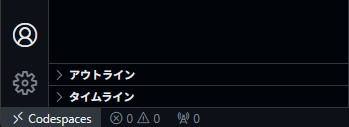

# starter-java-build-tools

環境構築不要！ブラウザだけで学べるJava言語を使ったビルドの基礎を学習講座へようこそ。

このリポジトリは、**GitHub Codespaces** を使って、Javaプログラミング入門を済ませた新卒プログラマがビルドツールを実体験を通じて学べるように作っています。

> **⚠️ 学習上の重要ルール**
> [Welcome to Apache Maven](https://maven.apache.org/) の情報が「最新かつ正確」な一次情報です。
> [Gradle User Manual](https://docs.gradle.org/current/userguide/userguide.html) の情報が「最新かつ正確」な一次情報です。
> ここで記載した内容や、もし AI から回答を得た場合であっても、**必ず公式の記載を確認しながら実装する癖** をつけてください。

---

> ========================
> 
> このコンテナの起動には、非常に時間がかかります。  
> 画面右下に「setting up remote connection building codespace」と表示されるので、クリックすると起動ログをターミナルに表示することができます。
>
> ========================

---

## 💻 1. 開発環境 (Development Environment)

この勉強会では **GitHub Codespaces** を使用します。

面倒な環境構築は不要です。ブラウザさえあれば、すぐに学習を始められます。

1. **GitHubにログイン** してください（アカウントがない場合は作成してください）。

1. このリポジトリをフォークするため、右上の`fork`をクリックする。

    

1. `Create fork`ボタンをクリックして、フォーク（自分のアカウントにコピーして新しいリポジトリを作成）する。

    

1. `Codespace`を起動するため、`Code`タブに移動し、右上にある緑色の`code`のプルダウンメニューを開き、`Codespace`タブを開き、`Create codespace on main`をクリックする。

    

1. `Codespace`の生成にはしばらく時間がかかるため、しばらく待つ。

    

1. `VSCode`が起動するが、画面左下が`リモートを開いています...`の間は待つ。

    

1. 画面左下が`Codespace`になった場合は、`Codespace`が起動完了しました

    

環境が立ち上がったら、左側のファイル一覧から学習したい章のフォルダを開いてください。

### Codespaces利用上の注意

- `Github`の`Codespaces`を利用する。`Codespaces`は設定によってはコストがかかるため、[Codespace の利用上の注意](./CODE_SPACES_SERVICE.md) はよく確認すること。
- コストをかけないためにも、セキュリティの意味でも、使い終わったら [停止方法](./CODE_SPACES_SERVICE.md#3-停止方法) に従って停止することを推奨する。

---

## 🚀 2. 学習の始め方

1. **Codespaces を起動**
    - フォーク済みの自分のリポジトリで、`Code` タブ → `Codespaces` タブ → `Create codespace on main` をクリックする。
    - 起動手順の詳細は [1. 開発環境](#-1-開発環境-development-environment) を参照。

1. **環境の準備を待つ**
    - ブラウザでVS Codeが起動する。
    - 初回はJavaのセットアップや日本語化のために1〜2分ほどかかる。
    - 左下のステータスバーなどが落ち着くまで少し待つ。

1. **学習スタート！**
    - 左側のファイル一覧から `chapter-01-manual` （第1章）のフォルダを開く。
    - `README.md` をクリックして開き、解説を読みながら進める。
    - `README.md` を右クリックして「プレビューを開く (Open Preview)」を選ぶと読みやすくなる。

---

## 📚 3. この講座で学ぶこと

この講座は全8章で構成されています。章ごとにフォルダ（`chapter-XX-...`）が分かれているので、順番に進めてください。

| 章 | タイトル | 学ぶ内容 |
| :--- | :--- | :--- |
| **01** | [Javaビルドの基礎（手動コンパイルとJVM）](./chapter-01-manual/README.md) | 手動ビルド、class/Jarファイル、JVM |
| **02** | [ビルドツールの必要性とMaven入門](./chapter-02-maven-intro/README.md) | ビルドツールの必要性、Hello World (Maven)、POM、Mavenリポジトリ |
| **03** | [外部ライブラリの利用とリポジトリの理解](./chapter-03-maven-deps/README.md) | Gsonライブラリ、JSON処理、dependencies、リモート/ローカルリポジトリ |
| **04** | [プライベートリポジトリ (Nexus) へのアップロード](./chapter-04-maven-nexus/README.md) | Nexus、distributionManagement、SNAPSHOT/Release |
| **05** | [Mavenの基本設定とカスタマイズ](./chapter-05-maven-config/README.md) | エンコーディング、Javaバージョン、reporting、modules |
| **06** | [アセンブリと独自パッケージング](./chapter-06-maven-package/README.md) | JSON設定、ZIPファイル作成、Mavenリポジトリへアップロード |
| **07** | [Gradle入門（Mavenからの移行）](./chapter-07-gradle-intro/README.md) | GradleとMavenの違い、build.gradle、ライブラリ含むJar、Publish |
| **08** | [Gradleプラグインの実践活用](./chapter-08-gradle-plugins/README.md) | プラグイン（標準・ShadowJar）、コードフォーマット |

---

## ⚙️ 4. 動作環境 (Tech Stack)

この講座は以下の環境で動作するように設定されています（自動構築されます）。

- **OS:** Debian GNU/Linux (Bookworm)
- **Java:** OpenJDK 21
- **ビルドツール:** Maven, Gradle
- **インフラ:** Docker (Docker-in-Docker環境)
- **エディタ:** VS Code (Codespaces) 上に Java / Maven / Gradle / Docker 用の拡張機能を事前インストール済み

---

## 📝 重視する思想

このリポジトリでは、「実際に手を動かしてみる」ことを何より重視しています。

エンジニアの技術は、資料を読むだけで覚えたり、理解したりすることは難しいものです。

例えば、自動車教習所の教本を完璧に暗記したとしても、それだけで実際に車を運転できるようにはなりませんよね？

ハンドルを握り、アクセルを踏むという「実体験」がなければ、運転技術は身につきません。

ソフトウェア技術も同じです。

技術的な仕組みを知ることも大切ですが、実際に実行した経験こそが現場で役立ちます。

読むだけで終わらせず、ぜひご自身の手で実行してみてください。
