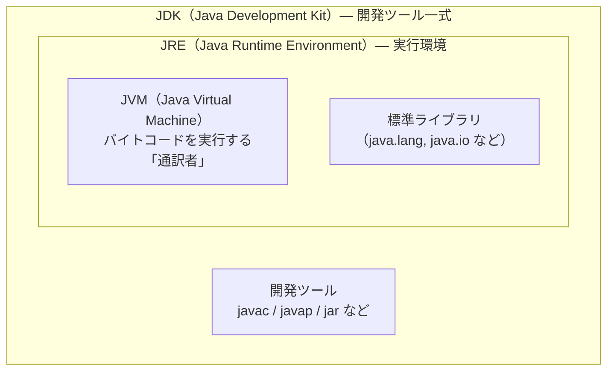
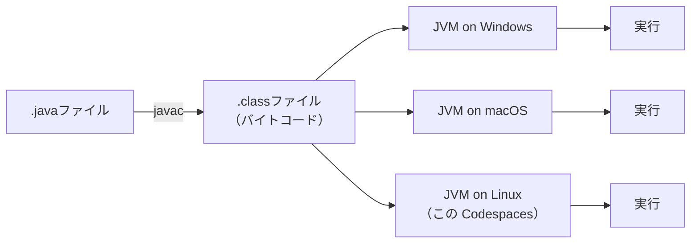

# 第1章: Javaビルドの基礎（手動コンパイルとJVM）

VS Code のボタンを押すとプログラムが動くのは分かるけど、裏で何が起きているの？

この疑問、エンジニアなら必ず通る道です。この章では **`javac`・`java`・`jar` の3つのコマンドだけ**を使い、Javaプログラムが「動く」ために必要なすべての工程を手作業で体験します。ビルドツールのことは一旦忘れて、まず土台を理解しましょう。

## この章で学ぶこと

- `javac` コマンドを使って `.java` ファイルをコンパイルできる
- `javap` コマンドを使って `.class` ファイルのバイトコードを確認できる
- JVM・JDK・JRE の関係を図を見ながら説明できる
- `-classpath` オプションを使って複数クラスをコンパイル・実行できる
- `jar` コマンドで実行可能 JAR を作成し `java -jar` で起動できる
- 手動ビルドの限界を体験し、ビルドツールが必要な理由を自分の言葉で語れる

## ステップ1: Hello World をコンパイルして実行しよう

### まず「-d オプションなし」で試してみる

いきなり正しい方法を教えるのではなく、まず「何も考えずにコンパイルしたらどうなるか」を体験してもらいます。

```bash
# chapter-01-manual ディレクトリで実行
javac src/main/java/com/example/HelloWorld.java
```

コンパイルは成功しますが、`.class` ファイルがどこに生成されたか確認してみましょう。

```bash
# chapter-01-manual ディレクトリで実行
ls src/main/java/com/example/
```

`HelloWorld.class` がソースコードと **同じフォルダ** に出てきてしまいました。ソースコード（`.java`）と実行ファイル（`.class`）が同じ場所に混在すると、ファイルが増えるにつれて管理が大変になります。現場では必ずソースと成果物を分けます。確認したら `.class` を削除しておきましょう。

```bash
# chapter-01-manual ディレクトリで実行
rm src/main/java/com/example/HelloWorld.class
```

### 出力先を分けてコンパイルする

`-d out` オプションを使うと、出力先ディレクトリを指定できます。まず出力先フォルダを作成します。

```bash
# chapter-01-manual ディレクトリで実行
mkdir -p out
```

> [!NOTE]
> `mkdir -p` の `-p` は「途中のディレクトリも含めて作成する」オプションです。`out/com/example/` のような深いパスも一度に作れます。

```bash
# chapter-01-manual ディレクトリで実行
javac -d out src/main/java/com/example/HelloWorld.java
```

出力されたファイルを確認してみましょう。

```bash
# chapter-01-manual ディレクトリで実行
ls -lh out/com/example/
```

`out/com/example/HelloWorld.class` というパスで生成されています。パッケージ名 `com.example` がそのままディレクトリ構造になっていることに注目してください。

### 実行する

```bash
# chapter-01-manual ディレクトリで実行
java -cp out com.example.HelloWorld
```

`Hello, World!` と表示されれば成功です。

> [!NOTE]
> `-cp out` は「`out` ディレクトリを `.class` ファイルの検索場所として使う」という指定です。`com.example.HelloWorld` はパッケージ名＋クラス名で、これが `out/com/example/HelloWorld.class` というファイルパスに対応しています。

**Why（なぜ `-d out` で分けるのか）**

Maven は `target/classes`、Gradle は `build/classes` というディレクトリに `.class` ファイルを出力します。これはどちらも「ソースと成果物を分離する」という思想に基づいています。手動コンパイルでも同じ習慣を身につけておきましょう。

## ステップ2: .class ファイルとバイトコードを覗いてみよう

### なぜ `.java` ファイルを直接実行できないのか？

試しに以下のコマンドを実行してみてください。

```bash
# chapter-01-manual ディレクトリで実行
java src/main/java/com/example/HelloWorld.java
```

エラーが出るか、もしくは予期しない動作になります。なぜでしょうか？

`.java` ファイルは人間が書いた「テキスト」です。CPU はテキストを直接理解できません。CPU が理解できる命令に変換する工程が必要で、それが `javac` （コンパイル）です。

コンパイルの流れを図で確認しましょう。


### javap でバイトコードを覗く

`.class` ファイルはバイナリ（機械向けのデータ）なので、テキストエディタで開いても読めません。`javap` コマンドを使うと、人間が読みやすい形式に変換して表示してくれます。

```bash
# chapter-01-manual ディレクトリで実行
javap out/com/example/HelloWorld.class
```

クラスの構造（メソッド名や戻り値の型）が表示されます。次に `-c` オプションを追加して、より詳細なバイトコード命令を見てみましょう。

```bash
# chapter-01-manual ディレクトリで実行
javap -c out/com/example/HelloWorld.class
```

`ldc "Hello, World!"` という行が見つかるはずです。バイトコードの命令を全部理解しなくて構いません。「`Hello, World!` という文字列がここに記録されている」ことだけ確認できれば十分です。

**Why — バイトコードにする理由:**
`.class` ファイルは特定の OS（Windows・Mac・Linux）に依存しない「中間コード」になっています。これがステップ3で学ぶ JVM の仕組みにつながります。

## ステップ3: JVM（Java仮想マシン）の仕組みを理解しよう

### なぜ機械語（バイナリ）にしないのか？

C言語などのコンパイル言語は、コンパイル結果が「機械語」になります。機械語はそのまま CPU が実行できますが、OS ごとに形式が違うため「Windows 用」「Mac 用」「Linux 用」とそれぞれ別にコンパイルが必要です。

Java はあえて機械語の一歩手前「バイトコード（`.class`）」で止めます。各 OS 上で動く **JVM（Java仮想マシン）** がバイトコードを受け取り、その OS に合わせてリアルタイムに実行してくれます。

JVM は通訳者のようなものです。`.class` ファイルは「万国共通の中間語」で書かれていて、各 OS という「方言話者」のために JVM がその場でリアルタイムに翻訳しながら実行します。

### JDK・JRE・JVM の関係

よく「JDK・JRE・JVM の違いは？」と聞かれます。以下の図で包含関係を確認しましょう。



- **JVM**: バイトコードを実行するエンジン。これが各 OS に合わせて動く
- **JRE**: JVM ＋ 標準ライブラリのセット。Javaプログラムを「実行」するだけなら JRE があれば十分
- **JDK**: JRE ＋ 開発ツール（`javac` など）のセット。Javaプログラムを「開発」するには JDK が必要

### Write Once, Run Anywhere

「一度書けば、どこでも動く」— これが Java の設計思想です。



あなたが今この Codespaces（Linux 環境）で `.class` ファイルを実行していること自体が、この「Write Once, Run Anywhere」の体験です。

インストールされている Java のバージョンを確認してみましょう。

```bash
java -version
javac -version
```

**Why — JDK のディストリビューションがたくさんある理由:**
現場では OpenJDK・Amazon Corretto・Eclipse Temurin など複数の「JDK ディストリビューション（配布版）」を見かけます。これらはどれも同じ Java 仕様に基づいて作られており、基本的な動作は同じです。企業が独自にサポートを提供するためにそれぞれのディストリビューションが存在しています。この Codespaces では OpenJDK 21 を使っています。

## ステップ4: 複数のクラスを手動でコンパイルしよう

> [!WARNING]
> これからわざと失敗させる手順を実行します。エラーが出ても慌てないでください。「どんなエラーが出るか」を体験することが目的です。

このプロジェクトには `HelloWorld.java` 以外に `App.java` と `Greeter.java` の2つのファイルがあります。

- `Greeter.java`: 挨拶メッセージを生成するクラス
- `App.java`: `Greeter` クラスを使って挨拶を表示するクラス（`App` は `Greeter` に依存している）

### 【わざと失敗】依存関係を無視してコンパイルする

`Greeter` をコンパイルせずに、いきなり `App` だけコンパイルしてみます。

```bash
# chapter-01-manual ディレクトリで実行
javac -d out src/main/java/com/example/App.java
```

以下のようなエラーが出るはずです。

```text
error: cannot find symbol
        String message = new Greeter().greet("世界");
                             ^
  symbol:   class Greeter
  location: class App
```

`cannot find symbol` は「そのクラスが見つからない」というエラーです。`App.java` の中で `Greeter` というクラスを使っているのに、`Greeter.class` がまだ存在しないため、`javac` が「`Greeter` って何？」となっています。

### 【解決手順1】依存される側（Greeter）を先にコンパイルする

依存関係の「根っこ」にあるクラスから先にコンパイルします。

```bash
# chapter-01-manual ディレクトリで実行
javac -d out src/main/java/com/example/Greeter.java
```

### 【解決手順2】-cp を指定して App をコンパイルする

`App.java` をコンパイルするとき、`javac` に「`Greeter.class` はここにあるよ」と教える必要があります。`-cp out` で `out` ディレクトリをクラス検索パスに指定します。

```bash
# chapter-01-manual ディレクトリで実行
javac -cp out -d out src/main/java/com/example/App.java
```

### 実行して確認する

```bash
# chapter-01-manual ディレクトリで実行
java -cp out com.example.App
```

「こんにちは、世界さん！」と表示されれば成功です。

> [!NOTE]
> `-cp` と `-classpath` は全く同じオプションです。`-cp` は `-classpath` の省略形として覚えておきましょう。

---

> **手動ビルドの限界**
>
> このプロジェクトはクラスが2つだけですが、現場のプロジェクトには数十〜数百のクラスがあります。ファイルを追加するたびにコンパイルコマンドを手で書き直し、依存関係の順序を間違えないように自分で管理する——これが毎日の作業だとしたらどうでしょうか？次章では、ビルドツール（Maven）がこの問題を解決する様子を体験します。

---

## ステップ5: JAR ファイルを作って実行しよう

### JAR と ZIP の違いは「約束事」だけ

JAR ファイルは、実は **ZIP ファイルと全く同じ圧縮形式**で作られています。拡張子が `.zip` ではなく `.jar` になっているだけで、解凍ツールで普通に開けます。違いは「`META-INF/MANIFEST.MF` という約束事ファイルが入っているかどうか」です。

| 種類 | 中身 | 用途 |
| :--- | :--- | :--- |
| ZIP | ただのファイル圧縮 | 汎用的なファイルまとめ |
| JAR | ZIP ＋ `META-INF/MANIFEST.MF` | Java が解釈できる約束事入りの ZIP |

### まず Manifest なしで JAR を作ってみる

> [!WARNING]
> これもわざと失敗させる手順です。エラーが出ることを確認してください。

```bash
# chapter-01-manual ディレクトリで実行
jar cf app.jar -C out .
```

> [!NOTE]
> `jar cf` の `c` は「create（作成）」、`f` は「ファイル名を指定する」という意味です。`-C out .` は「`out` ディレクトリに移動して、そのディレクトリ内の全ファイルを追加する」という指定です。

JAR の中身を確認してみましょう。ZIP と同じ構造であることが分かります。

```bash
# chapter-01-manual ディレクトリで実行
jar tf app.jar
```

では `java -jar` で実行しようとすると、どうなるでしょうか。

```bash
# chapter-01-manual ディレクトリで実行
java -jar app.jar
```

```text
no main manifest attribute, in app.jar
```

`no main manifest attribute` は「どのクラスを起動すればいいか書いてない」というエラーです。`MANIFEST.MF` に `Main-Class` を書いていないため、JVM がエントリポイント（プログラムの開始点）を見つけられません。

### MANIFEST.MF とは何か

`MANIFEST.MF` には JAR に関するさまざまなメタ情報（JAR 自身についての説明書き）を記述できます。主な設定項目を把握しておきましょう（今回使うのは `Main-Class` だけです）。

| 設定項目 | 役割 |
| :--- | :--- |
| `Main-Class` | 実行可能 JAR のエントリポイント指定（**今回学ぶ内容**） |
| `Class-Path` | JAR から別の JAR を参照するためのクラスパス指定 |
| `Implementation-Version` | JAR のバージョン情報 |
| `Sealed` | パッケージを封印して外部からの追加を防ぐセキュリティ設定 |

### MANIFEST.MF を作成して実行可能 JAR を作る

`MANIFEST.MF` を格納するディレクトリを作成します。

```bash
# chapter-01-manual ディレクトリで実行
mkdir -p meta
```

VS Code 左のエクスプローラーから `meta/MANIFEST.MF` を新規作成し、以下の内容を入力します。

```text
Manifest-Version: 1.0
Main-Class: com.example.App

```

> [!WARNING]
> **末尾の空行は必須です。** `Main-Class: com.example.App` の後に必ず空行（改行）を入れてください。空行がないと `Main-Class` が正しく読み込まれず、同じエラーが再発します。これは Java の仕様で定められた要件です。

Manifest を指定して JAR を再作成します。

```bash
# chapter-01-manual ディレクトリで実行
jar cfm app.jar meta/MANIFEST.MF -C out .
```

> [!NOTE]
> `cfm` の `m` は「Manifest ファイルを指定する」という意味です。`f`（ファイル名）の前に `m`（マニフェスト）を書く場合、コマンドライン引数も `app.jar meta/MANIFEST.MF` の順番に対応させる必要があります。

実行してみましょう。

```bash
# chapter-01-manual ディレクトリで実行
java -jar app.jar
```

「こんにちは、世界さん！」と表示されれば成功です。

JAR の中身に `META-INF/MANIFEST.MF` が追加されていることも確認しましょう。

```bash
# chapter-01-manual ディレクトリで実行
jar tf app.jar
```

**Why — なぜ現場で JAR を作るのか:**
複数の `.class` ファイルをまとめて1ファイルにすることで、配布やデプロイが単純になります。サーバーへのデプロイ時に「このファイル、あのファイル、そのファイルを…」とバラバラに転送する必要がなくなります。

現場でこの JAR 作成作業を手動でする人はいません。Maven の `mvn package`、Gradle の `gradle jar` がすべて自動化してくれます。次章でその恩恵を体験しましょう。

## 確認してみよう

この章で学んだことを自分の言葉で説明できるか確かめてみましょう。答えは記載していません。じっくり考えてみてください。

1. `javac -d out` の `-d` オプションはどういう意味ですか？省略するとどうなりますか？
2. `.java` ファイルと `.class` ファイルの違いを自分の言葉で説明してください。
3. JVM・JRE・JDK それぞれの役割を一言で説明してください。
4. なぜ `App.java` を単体でコンパイルしようとすると失敗するのですか？
5. JAR ファイルと ZIP ファイルの違いは何ですか？
6. `MANIFEST.MF` の `Main-Class` は何のために必要ですか？書かないとどうなりますか？

## まとめ

この章では `javac`・`java`・`jar` の3コマンドだけで、コンパイルから実行可能 JAR の作成まで全工程を手動で体験しました。

| 作業 | 手動でやると… | ビルドツールでは… |
| :--- | :--- | :--- |
| コンパイル順序の管理 | 自分で依存関係を把握して順番に実行 | 自動解決 |
| classpath の指定 | ファイルが増えるたびに長くなる | 自動設定 |
| 外部ライブラリの追加 | JAR を手動でダウンロードして `-cp` に追加 | `pom.xml` に1行書くだけ |
| JAR の作成 | Manifest を手書きして `jar` コマンドを実行 | `mvn package` 1コマンド |

手動ビルドの「面倒さ」を体感した今だからこそ、次章でビルドツール（Maven）が解決してくれる価値を実感できるはずです。

---

| | [全章目次](../README.md) | [第2章: ビルドツールの必要性とMaven入門 →](../chapter-02-maven-intro/README.md) |
| - | :-: | --: |
