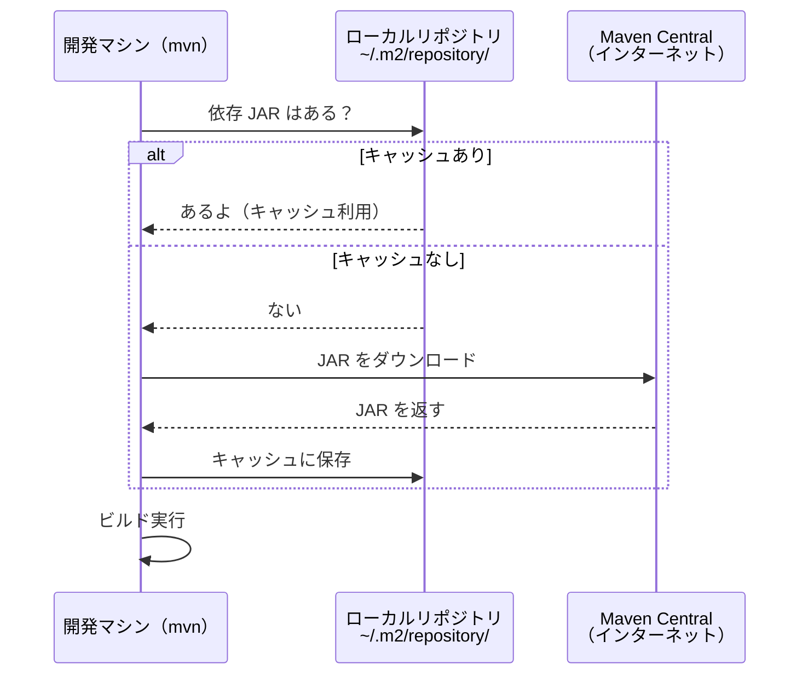

# 第2章: ビルドツールの必要性とMaven入門

第1章では `javac`・`jar` コマンドを手動で実行し、その手間を体験しました。
この章では Maven を使って同じ作業を劇的に簡単にする方法を学びます。

## この章で学ぶこと

- Maven がなぜ必要かを、第1章の体験をもとに説明できる
- 最小構成の `pom.xml` を読んでプロジェクトの定義を理解できる
- `mvn compile` と `mvn package` の違いを説明できる
- Maven ライフサイクルのフェーズが順序実行される仕組みを説明できる
- ローカルリポジトリとリモートリポジトリの役割を説明できる

## ステップ1: 第1章の「手動ビルドの限界」を振り返る

第1章でやってきた作業を思い出してみましょう。ファイルが増えるたびに、コマンドはどんどん長くなっていきましたね。
この章では右列の Maven を実際に体験します。

| 作業 | 手動でやると… | Maven では… |
| :--- | :--- | :--- |
| コンパイル | `javac -d out -cp ...` を自分で組み立てる | `mvn compile` 1コマンド |
| classpath 管理 | ファイルが増えるたびに `-cp` が長くなる | `pom.xml` の `<dependencies>` に書くだけ |
| JAR 作成 | `MANIFEST.MF` を手書きして `jar` コマンドを実行 | `mvn package` 1コマンド |
| 外部ライブラリ | JAR を手動ダウンロードして配置 | `pom.xml` に1行書くだけ（次章で体験） |

## ステップ2: Maven とは何か

Maven は Java プロジェクトのビルド作業を自動化するツールです。
Apache Software Foundation が開発しており、現場の多くのプロジェクトで使われています。

**Maven の4つの役割:**

1. コンパイル（`javac` の実行）
2. テスト（JUnit などの実行）
3. パッケージング（JAR 生成）
4. 依存関係管理（外部ライブラリの自動取得）

**「規約より設定（Convention over Configuration）」の思想:**

第1章では出力先を `-d out` で自分で決めていました。
Maven では `target/classes/` と「最初から決まっている」ため、設定ファイルへの記述が不要です。

`src/main/java/` というディレクトリ構造も Maven の規約で定められているため、どこにソースがあるかを設定ファイルへ書かずに済みます。
規約に従うことで「設定ファイルを書く量が最小限になる」のが Maven の大きな特徴です。

> **公式情報:** Maven の思想や仕組みは [Apache Maven 公式サイト](https://maven.apache.org/) で詳しく解説されています。

## ステップ3: pom.xml を作る

### pom.xml とは何か

`pom.xml`（Project Object Model）はプロジェクトの「住所録」のようなものです。
Maven はこのファイルを見てビルドの全工程を管理します。

この章では `pom.xml` がすでに用意されています。まず内容を確認しましょう。

```bash
# 作業ディレクトリへ移動
cd chapter-02-maven-intro

# 現在地を確認（末尾が chapter-02-maven-intro であること）
pwd
# => /workspaces/starter-java-build-tools/chapter-02-maven-intro
```

```bash
cat pom.xml
```

```xml
<?xml version="1.0" encoding="UTF-8"?>
<project xmlns="http://maven.apache.org/POM/4.0.0"
         xmlns:xsi="http://www.w3.org/2001/XMLSchema-instance"
         xsi:schemaLocation="http://maven.apache.org/POM/4.0.0
                             https://maven.apache.org/xsd/maven-4.0.0.xsd">
  <modelVersion>4.0.0</modelVersion>

  <groupId>com.example</groupId>
  <artifactId>chapter-02-maven-intro</artifactId>
  <version>1.0.0</version>

  <properties>
    <maven.compiler.source>21</maven.compiler.source>
    <maven.compiler.target>21</maven.compiler.target>
  </properties>
</project>
```

**各要素の意味:**

| 要素 | 意味 | 例 |
| :--- | :--- | :--- |
| `modelVersion` | POM 形式のバージョン。常に `4.0.0`（変更しない） | `4.0.0` |
| `groupId` | 組織やドメインを逆順にした識別子 | `com.example` |
| `artifactId` | プロジェクト名 | `chapter-02-maven-intro` |
| `version` | バージョン | `1.0.0` |
| `maven.compiler.source` | コンパイル時の Java バージョン | `21` |
| `maven.compiler.target` | 生成する .class ファイルの Java バージョン | `21` |

> [!NOTE]
> これらを指定しないと、Maven はデフォルトで古い Java バージョン（Java 5）でコンパイルしようとしてエラーになります。
> Java バージョン指定の詳しい仕組みは第5章で学びます。ここでは「必要な設定」として覚えておきましょう。

**「Maven 座標」という考え方:**

`groupId` + `artifactId` + `version` の組み合わせで、Maven リポジトリ上でプロジェクトを一意に特定できます。
これを「Maven 座標」と呼びます。住所（国・都市・番地）のようなイメージです。

### ディレクトリ構造を確認する

```bash
# chapter-02-maven-intro ディレクトリで実行
ls -la
ls src/main/java/com/example/
```

`src/main/java/com/example/` 配下に `App.java` と `Greeter.java` があることを確認してください。
このディレクトリ構造は Maven の規約です。設定ファイルに書かなくても Maven が自動的に認識します。

## ステップ4: mvn compile でコンパイルする

```bash
# chapter-02-maven-intro ディレクトリで実行
mvn compile
```

Maven が `target/classes/` ディレクトリを自動作成し、そこにクラスファイルを生成します。

**出力を確認:**

```bash
ls target/classes/com/example/
```

`App.class` と `Greeter.class` が生成されていれば成功です。

**第1章との比較（なぜ楽になったのか）:**

- `mkdir -p out` が不要になった → Maven が自動で `target/classes/` を作成する
- `-d out` の指定が不要になった → Maven の規約で出力先が決まっている
- 複数ファイルを1コマンドで処理できる → 依存関係の順序も自動解決される

**実行してみよう:**

```bash
java -cp target/classes com.example.App
```

`こんにちは、世界さん！` と表示されれば成功です。

## ステップ5: mvn package で JAR を作る

```bash
# chapter-02-maven-intro ディレクトリで実行
mvn package
```

**生成物を確認:**

```bash
ls target/
```

`chapter-02-maven-intro-1.0.0.jar` が生成されていることを確認してください。
JAR 名にバージョンが含まれる形式（`artifactId-version.jar`）で自動生成されます。

**第1章との比較（なぜ楽になったのか）:**

- `meta/MANIFEST.MF` の手書きが不要
- `jar cfm ...` コマンドが不要
- JAR 名がバージョンも含む形式で自動生成される

**mvn clean の使い方:**

```bash
mvn clean
ls target/
# => ls: cannot access 'target/': No such file or directory
```

`mvn clean` で `target/` ディレクトリが削除されます。
ビルド成果物をすべて削除して最初からやり直したいときに使います。

### わざと失敗させてみよう（次章への伏線）

> [!WARNING]
> これはわざと失敗させる手順です。エラーが出ることを確認してください。

```bash
mvn package
java -jar target/chapter-02-maven-intro-1.0.0.jar
# => no main manifest attribute, in target/chapter-02-maven-intro-1.0.0.jar
```

第1章と同じエラーが出ましたか？

Maven が生成する JAR はデフォルトでは `Main-Class` を `MANIFEST.MF` に設定しません。
このエラーは Maven プラグインの設定で解決できますが、その方法は後の章で学びます。
今は「Maven でも同じ問題が起きる」ことを覚えておきましょう。

## ステップ6: Maven ライフサイクルを理解する

Maven のビルドは「ライフサイクル」という概念で管理されています。
ライフサイクルは「フェーズ」と呼ばれる段階の連なりです。

**デフォルトライフサイクルの主要フェーズ:**


| フェーズ | 何をするか |
| :--- | :--- |
| `validate` | プロジェクトの設定が正しいか検証する |
| `compile` | ソースコードをコンパイルする |
| `test` | テストを実行する |
| `package` | コンパイル済みのコードを JAR などにまとめる |
| `install` | JAR をローカルリポジトリに登録する |
| `deploy` | JAR をリモートリポジトリにアップロードする |

### 重要なルール: フェーズは前から順番に実行される

後のフェーズを指定すると、それより前のフェーズがすべて自動で実行されます。

- `mvn package` を実行すると → `validate` + `compile` + `test` + `package` が順番に実行される
- `mvn compile` を実行すると → `validate` + `compile` だけ実行される

これが、`mvn compile` を実行していなくても `mvn package` だけで JAR が作れる理由です。

> **公式情報:** Maven のライフサイクルの詳細は
> [Introduction to the Build Lifecycle](https://maven.apache.org/guides/introduction/introduction-to-the-lifecycle.html)
> を参照してください。

## ステップ7: Maven リポジトリの仕組みを理解する

Maven は外部ライブラリを「リポジトリ」から取得します。
リポジトリには「ローカルリポジトリ」と「リモートリポジトリ」の2種類があります。

**ローカルリポジトリ:** `~/.m2/repository/`

- 一度ダウンロードした JAR はここにキャッシュされる
- 次回から同じ JAR を使う場合はインターネットにアクセスせずキャッシュを使用する

**リモートリポジトリ:** Maven Central（`https://repo.maven.apache.org/maven2/`）

- 世界中の Java ライブラリが公開されているリポジトリ
- デフォルトで Maven Central を参照する

**JAR の取得フロー:**



**ローカルリポジトリの中身を確認:**

```bash
ls ~/.m2/repository/
```

`mvn install` を実行すると、自分のプロジェクトをローカルリポジトリに登録できます。
他のプロジェクトの `pom.xml` からこのプロジェクトを依存として参照できるようになります。

## ステップ8: settings.xml を確認する

`~/.m2/settings.xml` は Maven の動作をカスタマイズするための設定ファイルです。

**主な設定項目:**

| 設定 | 役割 |
| :--- | :--- |
| `<mirrors>` | リポジトリのミラー設定（社内プロキシなど） |
| `<servers>` | リポジトリへの認証情報（第4章の Nexus で使用） |
| `<proxies>` | HTTP プロキシ設定 |

現時点では設定変更は不要です。まず存在するか確認してみましょう。

```bash
cat ~/.m2/settings.xml 2>/dev/null || echo "settings.xml は存在しません（デフォルト設定で動作中）"
```

「存在しません」と表示されても問題ありません。
Maven は `settings.xml` がなければデフォルト設定で動作します。
第4章の Nexus 接続時に、認証情報を `settings.xml` へ記述する方法を学びます。

> **公式情報:** `settings.xml` の設定項目一覧は
> [Settings Reference](https://maven.apache.org/settings.html)
> を参照してください。

## 確認してみよう

1. `pom.xml` の `groupId`・`artifactId`・`version` はそれぞれ何を意味しますか？
2. `mvn package` を実行すると、内部でどのフェーズが順番に実行されますか？
3. ローカルリポジトリとリモートリポジトリの役割の違いを説明してください。
4. Maven の「規約より設定」とはどういう意味ですか？`src/main/java/` を例に説明してください。

## まとめ

この章では Maven の基本を学びました。手動ビルドと比較して何が変わったかを整理します。

| 作業 | 手動でやると… | Maven では… |
| :--- | :--- | :--- |
| コンパイル | `javac -d out -cp ...` を自分で組み立てる | `mvn compile` 1コマンド |
| classpath 管理 | ファイルが増えるたびに `-cp` が長くなる | `pom.xml` の `<dependencies>` に書くだけ |
| JAR 作成 | `MANIFEST.MF` を手書きして `jar` コマンドを実行 | `mvn package` 1コマンド |
| 外部ライブラリ | JAR を手動ダウンロードして配置 | `pom.xml` に1行書くだけ（次章で体験） |

次章では外部ライブラリ（Gson）を `pom.xml` の `<dependencies>` に追加し、Maven がどのように自動でダウンロードするかを体験します。

---

| [← 第1章: Javaビルドの基礎（手動コンパイルとJVM）](../chapter-01-manual/README.md) | [全章目次](../README.md) | [第3章: 外部ライブラリの利用とリポジトリの理解 →](../chapter-03-maven-deps/README.md) |
| :--- | :---: | ---: |
