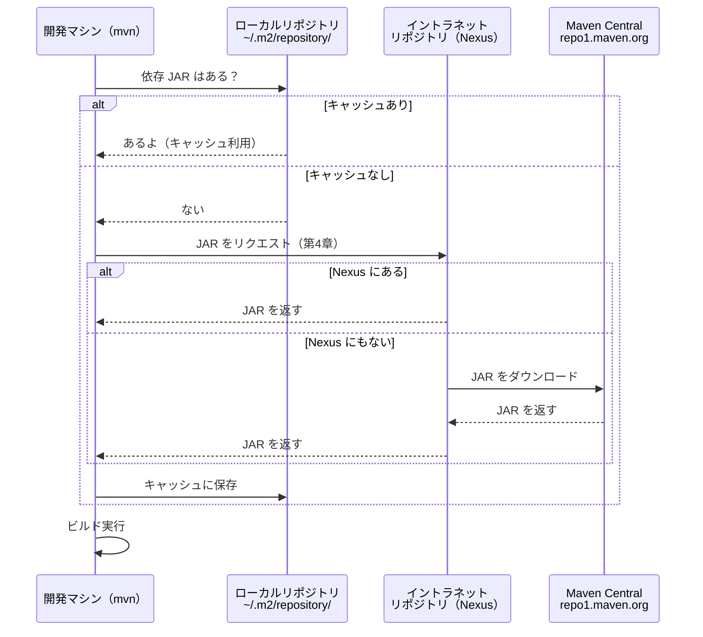

# 第3章: 外部ライブラリの利用とリポジトリの理解

第2章では `pom.xml` の基本と `mvn compile`・`mvn package` を学びました。
この章では `pom.xml` の `<dependencies>` に外部ライブラリを追加し、Maven がどのように自動でダウンロードして利用可能にするかを体験します。

## この章で学ぶこと

- `pom.xml` の `<dependencies>` に外部ライブラリを追加する方法を説明できる
- Maven が依存ライブラリをどこからどのように取得するかを説明できる
- ローカルリポジトリ・リモートリポジトリ・イントラネットリポジトリの違いを説明できる
- 依存スコープ（`scope`）の役割と主要な4種類を説明できる
- 推移的依存（transitive dependencies）とは何かを説明できる

## ステップ1: 第2章の「外部ライブラリ」を振り返る

第2章のまとめ表を思い出してください。最終行だけがまだ体験できていません。

| 作業 | 手動でやると… | Maven では… |
| :--- | :--- | :--- |
| コンパイル | `javac -d out -cp ...` を自分で組み立てる | `mvn compile` 1コマンド |
| classpath 管理 | ファイルが増えるたびに `-cp` が長くなる | `pom.xml` の `<dependencies>` に書くだけ |
| JAR 作成 | `MANIFEST.MF` を手書きして `jar` コマンドを実行 | `mvn package` 1コマンド |
| 外部ライブラリ | JAR を手動ダウンロードして配置 | `pom.xml` に1行書くだけ（**今章で体験**） |

**なぜ外部ライブラリが必要なのか:**

例えば Java オブジェクトを JSON 文字列に変換する場合、手書きすると次のような問題が起きます。

- 文字列中の `"` や `\` を正しくエスケープしないと壊れた JSON になる
- フィールドが `null` のとき出力するかどうかの判定が必要
- 日付型・コレクション型など、型ごとに変換処理を書く必要がある

このような「よくある処理」は既存のライブラリに任せるのが現場の常識です。
自前実装はバグの温床になります。

## ステップ2: Gson とは何か

**Gson** は Google が開発した Java 向け JSON シリアライズ／デシリアライズライブラリです。
シリアライズとは「Java オブジェクトを文字列（JSON）に変換すること」、
デシリアライズとは「文字列（JSON）を Java オブジェクトに戻すこと」です。

この章では次の Maven 座標（groupId + artifactId + version）で Gson を使用します。

```text
com.google.code.gson:gson:2.10.1
```

Maven 座標とは、ライブラリを特定するための「住所」のようなものです。
国（groupId）・都市（artifactId）・番地（version）の3要素で一意に識別します。

> **公式情報:** Gson のソースコードとドキュメントは
> [https://github.com/google/gson](https://github.com/google/gson) で公開されています。

## ステップ3: pom.xml に依存を追加する

Maven で外部ライブラリを使うには `pom.xml` の `<dependencies>` タグに `<dependency>` を追加します。

```xml
<?xml version="1.0" encoding="UTF-8"?>
<project xmlns="http://maven.apache.org/POM/4.0.0"
         xmlns:xsi="http://www.w3.org/2001/XMLSchema-instance"
         xsi:schemaLocation="http://maven.apache.org/POM/4.0.0
                             https://maven.apache.org/xsd/maven-4.0.0.xsd">
  <modelVersion>4.0.0</modelVersion>

  <groupId>com.example</groupId>
  <artifactId>chapter-03-maven-deps</artifactId>
  <version>1.0.0</version>

  <properties>
    <maven.compiler.source>21</maven.compiler.source>
    <maven.compiler.target>21</maven.compiler.target>
  </properties>

  <dependencies>
    <dependency>
      <groupId>com.google.code.gson</groupId>
      <artifactId>gson</artifactId>
      <version>2.10.1</version>
    </dependency>
  </dependencies>
</project>
```

`<dependency>` の3要素が Maven 座標と対応しています。

| タグ | 役割 | 例 |
| :--- | :--- | :--- |
| `<groupId>` | ライブラリの組織・グループ識別子 | `com.google.code.gson` |
| `<artifactId>` | ライブラリ名 | `gson` |
| `<version>` | バージョン番号 | `2.10.1` |

**Maven Central でライブラリを探す方法:**

Maven が使うリモートリポジトリ（Maven Central）の URL は次のとおりです。

```text
https://repo1.maven.org/maven2/
```

Gson の JAR がどこに置かれているか、ブラウザで確認できます。

```text
https://repo1.maven.org/maven2/com/google/code/gson/gson/2.10.1/
```

`groupId` のドット（`.`）がスラッシュ（`/`）に変換されてパスになっていることに注目してください。

検索に便利なサイトとして `mvnrepository.com` があります。
利用可能なリポジトリの一覧は次の URL で確認できます。

```text
https://mvnrepository.com/repos
```

> **調べてみよう:** Maven Central 以外にもリポジトリが存在します。
> `https://mvnrepository.com/repos` を開いて、どんなリポジトリがあるか調べてみましょう。

## ステップ4: curl で手動ダウンロードして実行する

まず「Maven なしで Gson を使えるか？」を体験します。
第1章でやったことと同じ構造です。手作業の面倒さを先に体感することで、次のステップでの Maven の便利さがより伝わります。

**作業ディレクトリへ移動:**

```bash
# 作業ディレクトリへ移動
cd chapter-03-maven-deps

# 現在地を確認（末尾が chapter-03-maven-deps であること）
pwd
# => /workspaces/starter-java-build-tools/chapter-03-maven-deps
```

**Maven Central から Gson JAR を curl で取得:**

```bash
mkdir lib
curl -L -o lib/gson-2.10.1.jar https://repo1.maven.org/maven2/com/google/code/gson/gson/2.10.1/gson-2.10.1.jar
ls lib/
# => gson-2.10.1.jar
```

**手動でコンパイルして実行（第1章スタイル）:**

```bash
mkdir -p target/classes
javac -d target/classes \
  -cp lib/gson-2.10.1.jar \
  src/main/java/com/example/Person.java \
  src/main/java/com/example/App.java

java -cp "target/classes:lib/gson-2.10.1.jar" com.example.App
# => {"name":"田中太郎","age":25}
```

動きました。しかしこの方法には問題があります。

- ライブラリが増えるたびに `curl` コマンドが増える
- `-cp` に JAR のパスを全部書き続けなければならない
- バージョンを変えたら手動でダウンロードし直す必要がある
- チームの全員が同じ手順を踏む必要がある（手順書が必要になる）

「この面倒さを Maven に任せるとどうなるか？」を次のステップで体験します。

## ステップ5: mvn compile でダウンロードを体験する

まず手動でダウンロードした `lib/` を削除してリセットします。

```bash
rm -rf lib/ target/
```

Maven に任せます。

```bash
# chapter-03-maven-deps ディレクトリで実行
mvn compile
```

初回実行時に Maven Central から Gson が自動ダウンロードされます。
ログに `Downloading from central: ...` と表示されることを確認してください。

**キャッシュ先を確認:**

```bash
ls ~/.m2/repository/com/google/code/gson/gson/2.10.1/
# => gson-2.10.1.jar  gson-2.10.1.jar.sha1  gson-2.10.1.pom  ...
```

ダウンロードした JAR が `~/.m2/repository/` にキャッシュされています。
ここがローカルリポジトリです。

**もう一度 mvn compile を実行してみましょう:**

```bash
mvn compile
```

今度は `Downloading from central:` が表示されません。
2回目以降はキャッシュを使うため、オフライン環境でもビルドできます。

ステップ4では `curl` コマンドを手動で実行しましたが、Maven は `pom.xml` の1行の記述から URL の組み立て・ダウンロード・classpath 設定まですべて自動化しています。

## ステップ6: プログラムを実行する

`mvn compile` でコンパイルできました。では実行してみましょう。

**まず、わざと失敗させます:**

```bash
java -cp target/classes com.example.App
# => Exception in thread "main" java.lang.NoClassDefFoundError: com/google/gson/Gson
```

エラーが出ました。なぜでしょうか？

**原因を理解する:**

- `target/classes/` には自分のコード（`App.class`, `Person.class`）しか入っていない
- Gson の JAR は `~/.m2/repository/` にあるため、classpath に含める必要がある
- `java` コマンドに `-cp target/classes` だけを指定すると Gson が見つからない

**解決1: Gson JAR を classpath に追加する（ステップ4と同じ仕組み）:**

```bash
java -cp "target/classes:$HOME/.m2/repository/com/google/code/gson/gson/2.10.1/gson-2.10.1.jar" com.example.App
# => {"name":"田中太郎","age":25}
```

動きましたが、パスが長くて書きづらいですね。

**解決2: Maven の exec プラグインで実行する:**

```bash
mvn exec:java -Dexec.mainClass=com.example.App
# => {"name":"田中太郎","age":25}
```

`exec:java` ゴールは classpath を自動解決するため、手動指定が不要です。
「`pom.xml` に書いた依存が自動で classpath に乗る」ことを実感できます。

**次章への伏線（わざと失敗させます）:**

> [!WARNING]
> これはわざと失敗させる手順です。エラーが出ることを確認してください。

```bash
mvn package
java -jar target/chapter-03-maven-deps-1.0.0.jar
# => no main manifest attribute, in target/chapter-03-maven-deps-1.0.0.jar
```

`mvn package` で生成した JAR には Gson が含まれておらず、`Main-Class` も設定されていません。
Gson を含む実行可能 JAR（Fat JAR / Uber JAR）を作る方法は第6章で学びます。

## ステップ7: 依存スコープ（scope）を理解する

`<dependency>` タグに `<scope>` を書くと、そのライブラリをどの場面で使うかを指定できます。

**`scope` を省略した場合のデフォルトは `compile` です。**

今回の Gson のように、コンパイル時・実行時の両方で必要なライブラリには `scope` を省略します。

主要な4スコープを整理します。

| スコープ | コンパイル時 | テスト時 | 実行時 | 代表例 |
| :--- | :---: | :---: | :---: | :--- |
| `compile` | ○ | ○ | ○ | Gson（今回） |
| `test` | ○ | ○ | × | JUnit |
| `provided` | ○ | ○ | × | Servlet API |
| `runtime` | × | ○ | ○ | JDBC ドライバ |

**`test` スコープの例（実行はしません）:**

テストフレームワーク JUnit は本番実行には不要なため `test` スコープで追加します。

```xml
<dependency>
  <groupId>org.junit.jupiter</groupId>
  <artifactId>junit-jupiter</artifactId>
  <version>5.10.1</version>
  <scope>test</scope>
</dependency>
```

`test` スコープのライブラリは `mvn package` で生成した JAR に含まれません。
本番の JAR を余計に大きくしないための仕組みです。

**`provided` スコープとはどんなときに使うか:**

Servlet API（Web アプリ開発で使う API）はアプリケーションサーバー（Tomcat など）が提供します。
このような「実行環境が用意してくれる」ライブラリには `provided` スコープを指定します。
JAR に含めてしまうと実行環境のものと衝突してエラーになります。

> **公式情報:** 依存スコープの詳細は
> [Introduction to the Dependency Mechanism](https://maven.apache.org/guides/introduction/introduction-to-dependency-mechanism.html)
> を参照してください。

## ステップ8: 推移的依存（transitive dependencies）を理解する

推移的依存とは、自分の使うライブラリがさらに別のライブラリに依存している関係のことです。

例えば「ライブラリ A を使いたい」とき、A が内部で「ライブラリ B」を使っていれば、B も必要です。
手動管理では「A の README を読んで B を調べ、B の README を読んで C を調べ…」と芋づる式に調査が必要です。
Maven はこの調査と取得を自動で行います。

**`mvn dependency:tree` で依存ツリーを確認:**

```bash
# chapter-03-maven-deps ディレクトリで実行
mvn dependency:tree
```

出力は次のようになります。

```text
[INFO] com.example:chapter-03-maven-deps:jar:1.0.0
[INFO] \- com.google.code.gson:gson:jar:2.10.1:compile
```

Gson は依存が少ないシンプルなライブラリのため、ツリーが浅いです。
しかし Spring Framework や Hibernate のような複雑なライブラリを使うと、数十個の推移的依存が表示されます。

このすべてを手動で調べて取得していたとしたら、大変な手間になります。
Maven が推移的依存を自動解決することで、`pom.xml` に書いた直接の依存だけを管理すればよくなります。

> **公式情報:** 推移的依存の詳細は
> [Introduction to the Dependency Mechanism](https://maven.apache.org/guides/introduction/introduction-to-dependency-mechanism.html)
> を参照してください。

## ステップ9: 3種類のリポジトリを整理する

Maven が JAR を取得する際に関わるリポジトリは3種類あります。

**ローカルリポジトリ:** `~/.m2/repository/`

一度取得した JAR のキャッシュです。2回目以降のビルドではここを参照するため高速です。
インターネットに接続できない環境でもキャッシュがあればビルドできます。

**リモートリポジトリ（Maven Central）:** `https://repo1.maven.org/maven2/`

世界中の Java ライブラリが公開されているリポジトリです。
Maven はデフォルトでここを参照します。

**イントラネットリポジトリ（社内リポジトリ）:** Nexus / Artifactory など。

企業の社内ネットワークに構築するプライベートリポジトリです。
主な用途は次のとおりです。

- 社外に公開できない社内ライブラリを管理する
- セキュリティ審査済みのライブラリだけを提供する
- Maven Central へのプロキシとして機能させ、社内のダウンロード速度を安定させる

この3者がどのようにやり取りするかを図で整理します。



この章では Maven Central から直接取得しています。
Nexus を使ったイントラネットリポジトリ経由での取得は第4章で体験します。

## 確認してみよう

1. `pom.xml` の `<dependency>` タグに書く3要素は何ですか？それぞれの役割を説明してください。
2. Maven が外部ライブラリをダウンロードするとき、ローカルリポジトリをチェックするのはなぜですか？
3. `scope` を省略した場合に適用されるデフォルトのスコープは何ですか？また `test` スコープとの違いを説明してください。
4. 推移的依存とは何ですか？なぜ Maven が自動で解決することが重要なのですか？

## まとめ

| 作業 | 手動でやると… | Maven では… |
| :--- | :--- | :--- |
| ライブラリ取得 | `curl` で JAR を手動ダウンロード | `pom.xml` に座標を書くだけで自動取得 |
| classpath 指定 | `-cp` に JAR のパスを全部書く | `mvn exec:java` で自動解決 |
| バージョン管理 | ファイル名で管理・更新が手動 | `version` を変えるだけで自動更新 |
| 推移的依存 | 依存の依存まで手動で調べて取得 | Maven が自動で解決 |

次章では、Nexus（プライベートリポジトリ）を Docker で立ち上げ、自分のプロジェクトをアップロード・ダウンロードする方法を学びます。

---

| [← 第2章: ビルドツールの必要性とMaven入門](../chapter-02-maven-intro/README.md) | [全章目次](../README.md) | [第4章: プライベートリポジトリ (Nexus) へのアップロード →](../chapter-04-maven-nexus/README.md) |
| :--- | :---: | ---: |
