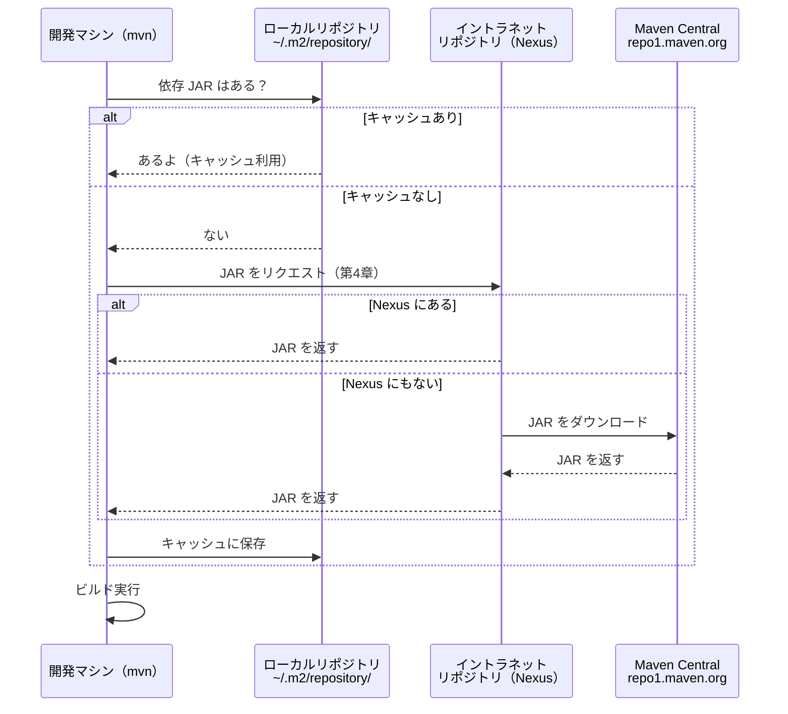
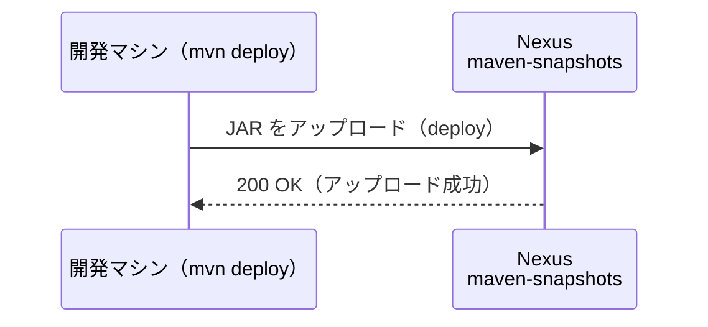
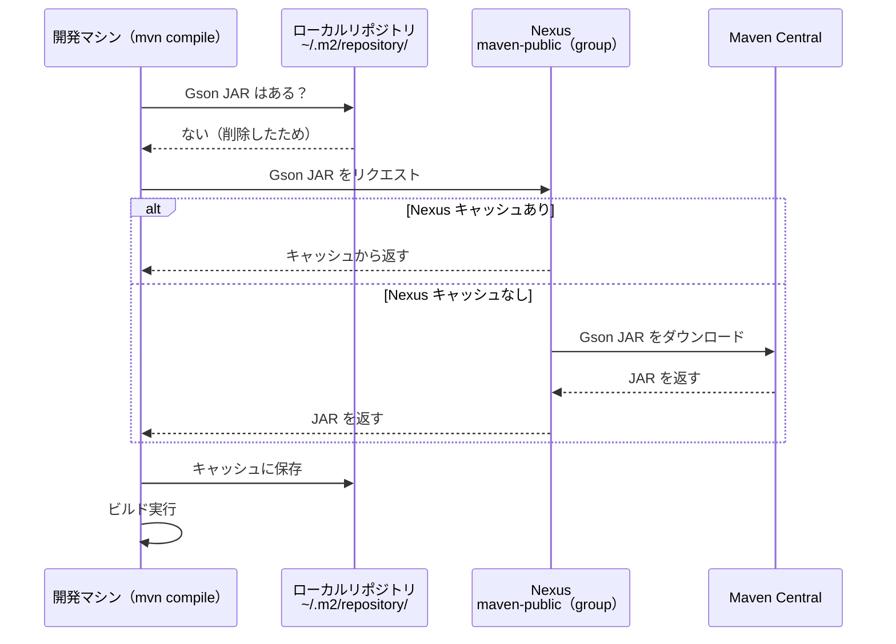

# 第4章: プライベートリポジトリ (Nexus) へのアップロード

第3章では Maven Central から外部ライブラリ（Gson）を自動取得する仕組みを学びました。
この章では、企業の現場で使われる**プライベートリポジトリ**（Nexus）を Docker で実際に起動し、
自分のプロジェクトをアップロード・ダウンロードする体験をします。

## この章で学ぶこと

- Nexus（プライベートリポジトリ）の役割と3種類のリポジトリ種別を説明できる
- `pom.xml` の `<distributionManagement>` の役割と書き方を説明できる
- `~/.m2/settings.xml` に認証情報とミラー設定を追加できる
- `mvn deploy` でプライベートリポジトリに JAR をアップロードできる
- SNAPSHOT と Release バージョンの違いと使い分けを説明できる

## ステップ1: 第3章の振り返り

第3章のステップ9では、Maven がライブラリを取得するときの流れをシーケンス図で確認しました。
図の中に「イントラネットリポジトリ（Nexus）」が登場し、「第4章で体験」と注釈されていました。



この章でその Nexus を実際に使ってみましょう。

## ステップ2: Nexus とは何か

**Sonatype Nexus Repository Manager** は、企業の現場で広く使われているプライベートリポジトリです。
Nexus には3種類のリポジトリがあります。

| 種別 | 役割 | 例 |
| :--- | :--- | :--- |
| ホスト型（hosted） | 自社で作成した JAR を格納する | `maven-releases`、`maven-snapshots` |
| プロキシ型（proxy） | 外部リポジトリのキャッシュ | `maven-central`（Maven Central を代理） |
| グループ型（group） | 複数リポジトリをまとめて1つの URL で提供 | `maven-public` |

**なぜ現場で Nexus を使うのか:**

- 社外に公開できない社内ライブラリを管理できる
- セキュリティ審査済みのライブラリだけをチームに提供できる（ガバナンス）
- Maven Central へのトラフィックを Nexus がキャッシュするため、ダウンロードが高速になる
- Maven Central が一時的にダウンしてもキャッシュから取得できる

## ステップ3: Docker で Nexus を起動を確認する

Docker のコマンドで Nexus が起動しているか確認します。

```bash
docker ps -a | grep nexus

# => 5279104389a3 sonatype/nexus3:latest "/opt/sonatype/nexus…" 2 hours ago Up 49 minutes  0.0.0.0:8081->8081/tcp, [::]:8081->8081/tcp   nexus
```

> [!NOTE]
> Nexus の起動していない場合、[停止方法](./CODE_SPACES_SERVICE.md#3-停止方法) を参考に停止し、再度 Codespaces を作り直してください。

## ステップ4: Nexus を初期設定する

**ブラウザで Nexus UI を開く（Codespaces のポート転送を使用）:**

> [!IMPORTANT]
> Codespaces 環境では `nexus:8081` をブラウザで直接開くことはできません。
> 次の手順でアクセスしてください。
>
> 1. VSCode 下部の「ポート」タブを開く
> 2. ポート `8081` の行にある「転送されたアドレス」の地球アイコンをクリック
> 3. ブラウザで Nexus のログイン画面が開く

**初期パスワードを確認する:**

```bash
docker exec nexus cat /nexus-data/admin.password
```

**セットアップ手順:**

1. ユーザー名 `admin`・上記パスワードでログイン
2. セットアップウィザードに従いにて、パスワードを変更する（必ずメモを取ること）
3. 利用規約を確認してから、同意する
4. 「Enable anonymous access」の選択（学習目的なら有効でも可）
5. 完了後、「Browse」メニューでデフォルトリポジトリを確認する

**デフォルトで存在するリポジトリ:**

| リポジトリ名 | 種別 | 役割 |
| :--- | :--- | :--- |
| `maven-releases` | hosted | Release JAR の格納先 |
| `maven-snapshots` | hosted | SNAPSHOT JAR の格納先 |
| `maven-central` | proxy | Maven Central のキャッシュ |
| `maven-public` | group | 上記3つをまとめた仮想リポジトリ |

> [!NOTE]
> ここで設定したパスワードは後続のステップで使用します。必ずメモしておきましょう。

## ステップ5: settings.xml に認証情報を設定する

Maven が Nexus に JAR をアップロードするには、認証情報が必要です。
認証情報はセキュリティ上の理由から `pom.xml` には書かず、`~/.m2/settings.xml` に書きます。

まず現在の状態を確認します。

```bash
cat ~/.m2/settings.xml 2>/dev/null || echo "settings.xml は存在しません（新規作成）"
```

**新規作成の場合**

```bash
# まずはフォルダを作成します。
sudo mkdir ~/.m2
```

以下の内容で `~/.m2/settings.xml` を作成してください。
`【変更後のパスワード】` の部分は、ステップ4で設定したパスワードに書き換えます。

```bash
sudo vim ~/.m2/settings.xml
```

```xml
<settings xmlns="http://maven.apache.org/SETTINGS/1.0.0"
          xmlns:xsi="http://www.w3.org/2001/XMLSchema-instance"
          xsi:schemaLocation="http://maven.apache.org/SETTINGS/1.0.0
                              https://maven.apache.org/xsd/settings-1.0.0.xsd">
  <servers>
    <server>
      <id>nexus-snapshots</id>
      <username>admin</username>
      <password>【変更後のパスワード】</password>
    </server>
    <server>
      <id>nexus-releases</id>
      <username>admin</username>
      <password>【変更後のパスワード】</password>
    </server>
  </servers>
</settings>
```

**`<id>` の対応関係を理解しましょう:**

`settings.xml` の `<server>` の `<id>` は、次のステップで確認する `pom.xml` の `<distributionManagement>` の `<id>` と**完全に一致させる必要があります**。
一致しないと Maven が認証情報を見つけられず、デプロイが `401 Unauthorized` で失敗します。

## ステップ6: pom.xml の distributionManagement を確認する

この章の `pom.xml` にはあらかじめ `<distributionManagement>` が記述されています。
ファイルを開いて確認してみましょう。

```xml
<distributionManagement>
  <snapshotRepository>
    <id>nexus-snapshots</id>
    <url>http://nexus:8081/repository/maven-snapshots/</url>
  </snapshotRepository>
  <repository>
    <id>nexus-releases</id>
    <url>http://nexus:8081/repository/maven-releases/</url>
  </repository>
</distributionManagement>
```

各要素の意味を整理します。

| 要素 | 意味 |
| :--- | :--- |
| `<snapshotRepository>` | SNAPSHOT バージョンのアップロード先 |
| `<repository>` | Release バージョンのアップロード先 |
| `<id>` | `settings.xml` の `<server>` と一致させる識別子 |
| `<url>` | Nexus のリポジトリ URL（ターミナルからは `nexus:8081` で到達可能） |

Maven はバージョン文字列を見て、`-SNAPSHOT` で終わる場合は `<snapshotRepository>` へ、
それ以外は `<repository>` へ自動的にアップロードします。

## ステップ7: mvn deploy で Nexus にアップロードする

準備が整いました。デプロイを実行してみましょう。

```bash
cd chapter-04-maven-nexus

pwd
# => /workspaces/starter-java-build-tools/chapter-04-maven-nexus

mvn deploy
```

`mvn deploy` は `validate → compile → test → package → install → deploy` の全フェーズを実行します。
最後の `deploy` フェーズで Nexus への JAR アップロードが行われます。

```log
 $ mvn deploy
[INFO] Scanning for projects...
[INFO] 
[INFO] -----------------< com.example:chapter-04-maven-nexus >-----------------
[INFO] Building chapter-04-maven-nexus 1.0.0-SNAPSHOT
[INFO] --------------------------------[ jar ]---------------------------------
Downloading from central: https://repo.maven.apache.org/maven2/org/apache/maven/plugins/maven-resources-plugin/2.6/maven-resources-plugin-2.6.pom
Downloaded from central: https://repo.maven.apache.org/maven2/org/apache/maven/plugins/maven-resources-plugin/2.6/maven-resources-plugin-2.6.pom (8.1 kB at 19 kB/s)
・
・（Downloading from central が続く）
・
Downloading from nexus-snapshots: http://nexus:8081/repository/maven-snapshots/com/example/chapter-04-maven-nexus/maven-metadata.xml
Uploading to nexus-snapshots: http://nexus:8081/repository/maven-snapshots/com/example/chapter-04-maven-nexus/1.0.0-SNAPSHOT/maven-metadata.xml
Uploaded to nexus-snapshots: http://nexus:8081/repository/maven-snapshots/com/example/chapter-04-maven-nexus/1.0.0-SNAPSHOT/maven-metadata.xml (783 B at 14 kB/s)
Uploading to nexus-snapshots: http://nexus:8081/repository/maven-snapshots/com/example/chapter-04-maven-nexus/maven-metadata.xml
Uploaded to nexus-snapshots: http://nexus:8081/repository/maven-snapshots/com/example/chapter-04-maven-nexus/maven-metadata.xml (293 B at 5.2 kB/s)
[INFO] ------------------------------------------------------------------------
[INFO] BUILD SUCCESS
[INFO] ------------------------------------------------------------------------
[INFO] Total time:  34.848 s
[INFO] Finished at: 2026-05-06T10:45:16Z
[INFO] ------------------------------------------------------------------------
```

**Nexus UI でアップロードを確認する:**

1. ブラウザで Nexus UI を開く（ポートタブの転送アドレス）
2. 左メニューの「Browse」をクリック
3. `maven-snapshots` を選択
4. `com/example/chapter-04-maven-nexus/1.0.0-SNAPSHOT/` フォルダが表示されれば成功

**SNAPSHOT なので上書きデプロイができます:**

```bash
mvn deploy
# → 成功（SNAPSHOT は上書き可能）
```

第3章のシーケンス図では「ローカルリポジトリ → Nexus → Maven Central」の流れを学びました。
このステップでは逆方向、つまり**開発マシンから Nexus へアップロードする**流れを体験しています。



## ステップ8: ローカルキャッシュを削除して Nexus から取得する

今度は Nexus を**ダウンロード経路**として使う体験をします。
Maven Central への直接通信を Nexus 経由に切り替えます。

**settings.xml にミラー設定を追加する:**

`~/.m2/settings.xml` を開き、`</settings>` の直前に `<mirrors>` セクションを追加します。

```xml
<settings xmlns="http://maven.apache.org/SETTINGS/1.0.0"
          xmlns:xsi="http://www.w3.org/2001/XMLSchema-instance"
          xsi:schemaLocation="http://maven.apache.org/SETTINGS/1.0.0
                              https://maven.apache.org/xsd/settings-1.0.0.xsd">
  <servers>
    <server>
      <id>nexus-snapshots</id>
      <username>admin</username>
      <password>【変更後のパスワード】</password>
    </server>
    <server>
      <id>nexus-releases</id>
      <username>admin</username>
      <password>【変更後のパスワード】</password>
    </server>
    <!-- ミラー経由のダウンロードにも認証が必要なため追加 -->
    <server>
      <id>nexus-public</id>
      <username>admin</username>
      <password>【変更後のパスワード】</password>
    </server>
  </servers>
  <mirrors>
    <mirror>
      <id>nexus-public</id>
      <mirrorOf>central</mirrorOf>
      <url>http://nexus:8081/repository/maven-public/</url>
    </mirror>
  </mirrors>
</settings>
```

> [!IMPORTANT]
> Maven は `<mirror>` の `<id>` と一致する `<server>` エントリを探して認証情報を取得します。
> `nexus-public` の `<server>` エントリがないと、ミラーへのリクエストが認証なしで送られ
> `401 Unauthorized` になります。アップロード用（`nexus-snapshots`・`nexus-releases`）と
> ダウンロード用（`nexus-public`）で `<id>` が異なるため、3つとも必要です。

`mirrorOf=central` は「Maven Central への全リクエストをこのミラーに向ける」という意味です。
Nexus の `maven-public` グループは `maven-central`（プロキシ）を含むため、Nexus がキャッシュを返してくれます。

**ローカルキャッシュを削除する:**

```bash
rm -rf ~/.m2/repository/com/google/code/gson/
```

**Nexus 経由でダウンロードして実行する:**

```bash
mvn clean compile
# → Nexus の maven-public 経由で Gson がダウンロードされる

mvn exec:java -Dexec.mainClass=com.example.App
# => {"name":"田中太郎","age":25}
```

**Nexus UI でプロキシキャッシュを確認する:**

1. ブラウザで Nexus UI を開く
2. 左メニューの「Browse」をクリック
3. `maven-public` → `com/google/code/gson/gson/2.10.1/` が表示されれば Nexus 経由でダウンロードされた証拠

ここまでの流れを図で整理します。



## ステップ9: SNAPSHOT と Release の違いを理解する

SNAPSHOT と Release はバージョン管理における重要な概念です。

| 項目 | SNAPSHOT | Release |
| :--- | :--- | :--- |
| バージョン例 | `1.0.0-SNAPSHOT` | `1.0.0` |
| 上書きデプロイ | 可能 | 不可（エラー） |
| 用途 | 開発中・テスト中 | 本番・安定版 |
| Maven の再確認 | 毎回チェック | キャッシュを使い続ける |
| 格納先 | `maven-snapshots` | `maven-releases` |

**Release バージョンでデプロイしてみましょう:**

`pom.xml` の `<version>` を変更します。

```xml
<version>1.0.0</version>
```

デプロイを実行します。

```bash
mvn deploy
# → maven-releases にアップロードされる
```

Nexus UI の `maven-releases` で `com/example/chapter-04-maven-nexus/1.0.0/` を確認してください。

**Release の上書き禁止を体験する:**

もう一度同じバージョンでデプロイしてみましょう。

```bash
mvn deploy
# => Could not PUT ... Return code is: 400, ReasonPhrase: Repository does not allow updating assets
```

エラーが発生しました。これは意図的な制限です。

Release バージョンは「不変」であることが原則です。
なぜなら、チームの誰かが `1.0.0` を使ってビルドしたとき、後から `1.0.0` が別の内容に書き換えられると、同じバージョン番号なのに動作が変わるという混乱が起きます。
このような「再現性の破壊」を防ぐため、Release は上書きできません。

> **現場の鉄則:** Release バージョンは絶対に上書きしない。変更が必要なら `1.0.1` など新しいバージョン番号を使う。

## 確認してみよう

1. `distributionManagement` の `<snapshotRepository>` と `<repository>` の違いを説明してください。
2. `settings.xml` の `<server>` の `<id>` と `pom.xml` の `<distributionManagement>` の `<id>` を一致させる理由は何ですか？
3. Nexus のホスト型・プロキシ型・グループ型リポジトリの役割をそれぞれ説明してください。
4. SNAPSHOT バージョンと Release バージョンの違いを説明してください。なぜ現場では Release を上書きデプロイしないのですか？

## まとめ

| 作業 | 設定場所 | 役割 |
| :--- | :--- | :--- |
| アップロード先の指定 | `pom.xml` の `<distributionManagement>` | SNAPSHOT/Release の URL を定義 |
| 認証情報 | `~/.m2/settings.xml` の `<servers>` | Nexus へのログイン情報 |
| ダウンロードの経路変更 | `~/.m2/settings.xml` の `<mirrors>` | Maven Central を Nexus 経由にルーティング |
| アップロードコマンド | `mvn deploy` | 全フェーズを実行してリポジトリに公開 |

次章では Maven の詳細設定（エンコーディング・Java バージョン・レポーティング・マルチモジュール）を学びます。

---

| [← 第3章: 外部ライブラリの利用とリポジトリの理解](../chapter-03-maven-deps/README.md) | [全章目次](../README.md) | [第5章: Mavenの基本設定とカスタマイズ →](../chapter-05-maven-config/README.md) |
| :--- | :---: | ---: |
