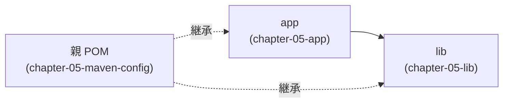

# 第5章: Mavenの基本設定とカスタマイズ

第4章では Nexus を使ったプライベートリポジトリへのアップロード・ダウンロードを体験しました。
この章では `pom.xml` をより実践的にする3つの設定要素を学びます。

## この章で学ぶこと

- エンコーディング警告が発生する原因と `project.build.sourceEncoding` の役割を説明できる
- `maven.compiler.source`/`target` と `maven.compiler.release` の違いを説明できる
- `<reporting>` タグの役割と `mvn site` で生成されるものを説明できる
- `<modules>` タグを使ったマルチモジュールプロジェクトの構造を説明できる
- 親 POM と子 POM の継承関係を説明できる

## ステップ1: 第4章の振り返り

第1〜4章で学んだ内容を整理します。

| 章 | 学んだこと | 主な設定 |
| :--- | :--- | :--- |
| 第2章 | Maven の基本とビルドフェーズ | `<groupId>`、`<artifactId>`、`<version>` |
| 第3章 | 外部ライブラリの取得 | `<dependencies>` |
| 第4章 | Nexus へのアップロード | `<distributionManagement>`、`settings.xml` |
| **第5章** | **pom.xml のより良い設定** | **`<properties>`、`<reporting>`、`<modules>`** |

第2〜4章の `pom.xml` にはすでに `<properties>` がありましたが、設定が不完全でした。
この章でその問題を体験し、正しい設定を学びます。

## ステップ2: エンコーディング警告を体験する

まず、作業ディレクトリへ移動します。

```bash
cd chapter-05-maven-config

pwd
# => /workspaces/starter-java-build-tools/chapter-05-maven-config
```

この章のプロジェクトは `lib` と `app` の2モジュール構成です。
親ディレクトリでビルドコマンドを実行してみましょう。

```bash
mvn compile
```

ビルドは成功しますが、次のような WARNING が出力されます。

```log
[WARNING] Using platform encoding (UTF-8 actually) to copy filtered resources,
          i.e. build is platform dependent!
```

このメッセージが意味することを確認します。

- **platform encoding（プラットフォームエンコーディング）** とは、実行環境の OS がデフォルトで使う文字コードのことです
- Linux や macOS では通常 UTF-8 ですが、**Windows では Shift-JIS（MS932）がデフォルト**です
- `Greeter.java` には日本語文字列（`"こんにちは、"` など）が含まれています
- エンコーディングを明示しないままビルドすると、**Windows 環境では日本語の文字化けが発生する**可能性を持ちます

「`UTF-8 actually`」と表示されているため今は問題ありませんが、チームに Windows ユーザーがいる場合は危険な設定です。

## ステップ3: エンコーディングを統一する（project.build.sourceEncoding）

`pom.xml` を開き、`<properties>` セクションに1行追加します。

```bash
vim pom.xml
```

```xml
<properties>
  <maven.compiler.source>21</maven.compiler.source>
  <maven.compiler.target>21</maven.compiler.target>
  <project.build.sourceEncoding>UTF-8</project.build.sourceEncoding>
</properties>
```

再度ビルドを実行します。

```bash
mvn compile
```

今度は WARNING が表示されなくなりました。

**なぜ `pom.xml` に書くのか:**

`project.build.sourceEncoding` は Maven の特殊なプロパティで、以下の2か所に同時に適用されます。

| 適用先 | 役割 |
| :--- | :--- |
| `maven-compiler-plugin` | `javac` の `-encoding` オプションに渡される |
| `maven-resources-plugin` | リソースファイルのコピー時に使う文字コード |

コンパイラとリソースの両方に一括設定できるため、`pom.xml` に1か所書くだけで済みます。

## ステップ4: Javaバージョン指定を改善する（maven.compiler.release）

第2〜4章では Java バージョン指定に `maven.compiler.source` と `maven.compiler.target` を使ってきました。
しかし現場では `maven.compiler.release` を使うことが推奨されています。

**`source`/`target` の問題:**

`maven.compiler.source=8` と `maven.compiler.target=8` を設定しても、実際には JDK 21 の API を使ったコードをコンパイルできてしまいます。
たとえば JDK 9 以降で追加された `List.of()` などを使っても、`source=8`/`target=8` ではコンパイルエラーになりません。
その JAR を Java 8 環境で実行すると、`NoSuchMethodError` が発生します。

**`maven.compiler.release` の利点:**

`release` フラグは「ソースバージョン」「バイトコードバージョン」「ブートクラスパス（API の参照先）」の**3つを同時に制御**します。
指定したバージョンに存在しない API を誤って呼び出すとコンパイルエラーになるため、より安全です。

| プロパティ | 制御対象 |
| :--- | :--- |
| `maven.compiler.source` | ソースコードのバージョン（構文チェック） |
| `maven.compiler.target` | バイトコードのバージョン（出力形式） |
| `maven.compiler.release` | 上記3つすべて（API の利用可能範囲も制限） |

`pom.xml` を修正します。`maven.compiler.source` と `maven.compiler.target` を削除し、`maven.compiler.release` に変更します。

```xml
<properties>
  <project.build.sourceEncoding>UTF-8</project.build.sourceEncoding>
  <maven.compiler.release>21</maven.compiler.release>
</properties>
```

ビルドして動作を確認します。

```bash
mvn compile
# => BUILD SUCCESS
```

> [!NOTE]
> `maven.compiler.release` は Java 9 以降（Maven Compiler Plugin 3.6 以降）で使用できます。
> Java 8 以前をターゲットにする場合は `source`/`target` を使う必要があります。

## ステップ5: reporting タグとサイト生成（mvn site）

`<reporting>` タグは `mvn site` コマンドが参照する設定です。
`<build>` タグ内の `<plugins>` とは異なり、**プロジェクトドキュメントのレポート生成**に使います。

| タグ | 役割 |
| :--- | :--- |
| `<build><plugins>` | コンパイル・テスト・パッケージングなどのビルド処理を制御 |
| `<reporting><plugins>` | `mvn site` で生成する HTML レポートを制御 |

この章の `pom.xml` には Javadoc レポートと、サイトプラグインのバージョン固定が設定されています。

```xml
<build>
  <pluginManagement>
    <plugins>
      <plugin>
        <groupId>org.apache.maven.plugins</groupId>
        <artifactId>maven-site-plugin</artifactId>
        <version>3.12.1</version>
      </plugin>
      <plugin>
        <groupId>org.apache.maven.plugins</groupId>
        <artifactId>maven-project-info-reports-plugin</artifactId>
        <version>3.5.0</version>
      </plugin>
    </plugins>
  </pluginManagement>
</build>

<reporting>
  <plugins>
    <plugin>
      <groupId>org.apache.maven.plugins</groupId>
      <artifactId>maven-javadoc-plugin</artifactId>
      <version>3.6.3</version>
    </plugin>
  </plugins>
</reporting>
```

`<build><pluginManagement>` でサイトプラグインのバージョンを固定しているのは、Maven 3.8 との互換性のためです。
バージョンを指定しないとデフォルトの古いバージョン（3.3）が使われてしまい、`mvn site` がエラーになります。

サイトを生成してみましょう。

```bash
mvn site
```

生成されたファイルを確認します。

```bash
ls app/target/site/
# => css/  images/  index.html  ...

ls lib/target/site/
# => css/  images/  index.html  ...
```

VS Code のエクスプローラーから `app/target/site/index.html` を右クリックし、「Show Preview」を選択するとブラウザでプロジェクトサイトを閲覧できます。

生成される主なレポートは次のとおりです。

| レポート | 内容 |
| :--- | :--- |
| Project Information | pom.xml から読み取ったプロジェクト情報 |
| Project Information > Dependencies | 依存ライブラリの一覧 |
| Project Reports > Javadoc | ソースコードから生成した API ドキュメント |

## ステップ6: マルチモジュールとは何か

**単一モジュール vs マルチモジュール:**

| 項目 | 単一モジュール | マルチモジュール |
| :--- | :--- | :--- |
| 構成 | 1つの `pom.xml`、1つの JAR | 親 `pom.xml` + 複数の子モジュール |
| 用途 | シンプルなアプリ | 機能を役割ごとに分割する大規模プロジェクト |
| 例 | 第2〜4章のプロジェクト | この章・Spring Boot プロジェクト |

**現場での典型的な分割例:**

```text
myapp/
├── pom.xml          ← 親 POM（共通設定・バージョン管理）
├── domain/          ← ビジネスロジック（Java クラスのみ）
├── infra/           ← データベース・外部 API との通信
└── web/             ← HTTP エンドポイント（infra・domain に依存）
```

モジュール間で依存関係を持たせることで、「`web` が `domain` の詳細に依存できない」という制約をビルドで強制できます。

## ステップ7: 親 POM と子 POM の構造を確認する

この章のプロジェクト構造を確認します。

```bash
cat pom.xml
```

親 POM の重要な点を確認します。

| 設定 | 内容 |
| :--- | :--- |
| `<packaging>pom</packaging>` | JAR を生成しない。モジュール管理専用のパッケージングタイプ |
| `<modules>` | ビルド対象のサブディレクトリ名を列挙 |
| `<properties>` | 子モジュールに**継承**される共通設定 |
| `<reporting>` | `mvn site` が参照するレポート設定 |

```bash
cat lib/pom.xml
```

子 POM（lib）の重要な点を確認します。

| 設定 | 内容 |
| :--- | :--- |
| `<parent>` | 親 POM の座標（groupId・artifactId・version）を参照 |
| `<artifactId>` のみ定義 | `groupId` と `version` は親から継承するため省略可能 |

```bash
cat app/pom.xml
```

`app` は `lib` への依存を持っています。
`groupId` や `version` を省略しているのは親 POM から継承されるためです。

**モジュール間依存の関係:**



## ステップ8: マルチモジュールをビルドする

**まず、`lib` を単独でビルドしようとして失敗を体験します:**

```bash
cd app
mvn compile
# => Could not resolve dependencies for project com.example:chapter-05-app:jar:1.0.0:
#    Could not find artifact com.example:chapter-05-lib:jar:1.0.0 in ...
```

`lib` がまだローカルリポジトリ（`~/.m2/repository`）に存在しないため、`app` は `lib` を見つけられません。
`cd ..` で親ディレクトリに戻ります。

```bash
cd ..

pwd
# => /workspaces/starter-java-build-tools/chapter-05-maven-config
```

**親ディレクトリで `mvn install` を実行する:**

```bash
mvn install
```

Maven は `<modules>` の定義と依存関係を解析し、**`lib` → `app` の順序でビルド**します。

```log
[INFO] Reactor Build Order:
[INFO]   chapter-05-maven-config                                          [pom]
[INFO]   chapter-05-lib                                                   [jar]
[INFO]   chapter-05-app                                                   [jar]
```

`mvn install` は各モジュールをローカルリポジトリに登録します。
これにより `app` が `lib` の JAR を参照できます。

**実行して確認する:**

```bash
java -cp app/target/chapter-05-app-1.0.0.jar:lib/target/chapter-05-lib-1.0.0.jar com.example.app.App
# => こんにちは、田中太郎さん！
```

> [!NOTE]
> Windows 環境では classpath の区切り文字が `;`（セミコロン）です。
> Codespaces（Linux）では `:`（コロン）を使います。

## 確認してみよう

1. `project.build.sourceEncoding=UTF-8` を設定しない場合、どのような問題が発生しますか？
2. `maven.compiler.source`/`target` と `maven.compiler.release` の違いを説明してください。
3. `<reporting>` タグと `<build>` タグの `<plugins>` の違いは何ですか？
4. マルチモジュールプロジェクトで `mvn install` を親ディレクトリで実行すると、なぜ `lib` が `app` より先にビルドされるのですか？

## まとめ

| 設定 | タグ | 役割 |
| :--- | :--- | :--- |
| エンコーディング統一 | `<project.build.sourceEncoding>` | プラットフォームに依存しないビルドを保証 |
| Java バージョン | `<maven.compiler.release>` | ソース・バイトコード・API の3つを同時制御 |
| サイト生成 | `<reporting>` | `mvn site` が使うレポートプラグインを定義 |
| マルチモジュール | `<modules>` / `<parent>` | プロジェクトを分割し、共通設定を親から継承 |

次章では、プログラム本体と設定ファイルをまとめた ZIP ファイルの作成と、Maven リポジトリへのアップロードを学びます。

---

| [← 第4章: プライベートリポジトリ (Nexus) へのアップロード](../chapter-04-maven-nexus/README.md) | [全章目次](../README.md) | [第6章: アセンブリと独自パッケージング →](../chapter-06-maven-package/README.md) |
| :--- | :---: | ---: |
