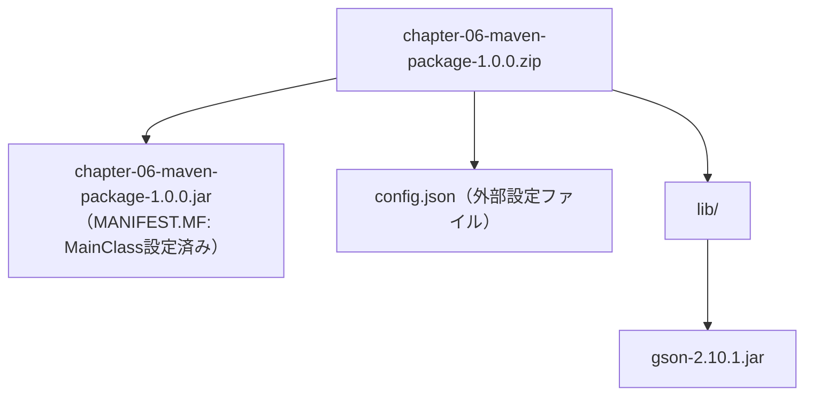
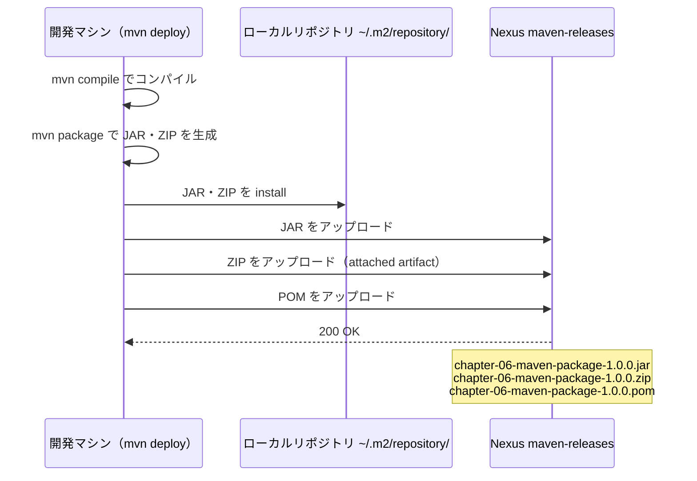

# 第6章: アセンブリと独自パッケージング

第5章では `pom.xml` のエンコーディング設定・Javaバージョン指定・マルチモジュール構成を学びました。
この章では「プログラムを別のサーバーやチームメンバーに渡す」という現場の課題を解決します。
JAR ファイルだけでは実行できない理由を体験し、必要なファイルをまとめた ZIP を作成・配布する方法を学びます。

## この章で学ぶこと

- `maven-assembly-plugin` の役割と、アセンブリディスクリプタ（`zip.xml`）の仕組みを説明できる
- `maven-jar-plugin` の `MANIFEST.MF` 設定と ZIP 内のディレクトリ構成の関係を説明できる
- 設定値をソースコードに直書き（ハードコード）することの問題点を説明できる
- 外部設定ファイル（`config.json`）を使うことで、ビルドなしに動作を変えられる理由を説明できる
- `mvn package` で ZIP を生成し、解凍して実行できる
- `mvn deploy` で JAR と ZIP の両方を Nexus にアップロードできる

## ステップ1: 第5章の振り返りと「JARだけでは足りない」問題

### 第2〜5章の振り返り

| 章 | 学んだこと | 主な設定 |
| :--- | :--- | :--- |
| 第2章 | Maven の基本とビルドフェーズ | `<groupId>`、`<artifactId>`、`<version>` |
| 第3章 | 外部ライブラリの取得と依存スコープ | `<dependencies>`、`<scope>` |
| 第4章 | Nexus へのアップロード | `<distributionManagement>`、`settings.xml` |
| 第5章 | pom.xml のより良い設定 | `<properties>`、`<reporting>`、`<modules>` |
| **第6章** | **複数ファイルをまとめた配布パッケージの作成** | **`maven-assembly-plugin`、`zip.xml`** |

### 「JARだけ渡しても動かない」現場の問題

開発が完了して、同僚にプログラムを渡す場面を想像してください。

---

**新人:** 「アプリ完成しました。JAR ファイルをメールで送ります！」

**先輩:** 「ありがとう。でも…`java -jar chapter-06-maven-package-1.0.0.jar` を実行したら、こんなエラーが出たよ？」

```log
エラー: config.json が見つかりません。
実行ディレクトリ: /home/senpai/downloads/.
ヒント: ZIP を展開したフォルダ内で java -jar コマンドを実行してください。
```

**新人:** 「あっ、`config.json` を送り忘れました…。あと、Gson のライブラリ JAR も必要で…」

**先輩:** 「それ、毎回ファイルを個別に集めるの？現場では実行に必要なものを全部まとめた配布物（アーカイブ）を作るんだよ。」

---

このアーカイブ（複数のファイルをひとつにまとめたもの）を作るのが、この章のテーマです。

**なぜ ZIP にまとめるのか（現場の動機）:**

| 課題 | ZIP にまとめることで解決できること |
| :--- | :--- |
| ファイルを個別に送るのは手間がかかる | 1ファイルを渡せば実行環境が揃う |
| 渡し忘れが発生する | 必要なファイルをビルド時に自動で同梱できる |
| Nexus にアップロードするファイルが複数になる | JAR と ZIP を同時にデプロイできる |

## ステップ2: アプリケーションの構成を確認する

まず、作業ディレクトリへ移動します。

```bash
# 作業ディレクトリへ移動
cd chapter-06-maven-package

# 現在地を確認（末尾が chapter-06-maven-package であること）
pwd
# => /workspaces/starter-java-build-tools/chapter-06-maven-package
```

ソースファイルの構成を確認します。

```bash
find src/ -type f | sort
```

```text
src/main/assembly/zip.xml
src/main/java/com/example/App.java
src/main/java/com/example/AppConfig.java
src/main/java/com/example/SalesReporter.java
src/main/resources/config.json
```

各ファイルの役割は次のとおりです。

| ファイル | 役割 |
| :--- | :--- |
| `App.java` | エントリーポイント。`config.json` を読み込み、`SalesReporter` を起動する |
| `AppConfig.java` | `config.json` の内容を保持するデータクラス（アプリ名・バージョン・処理件数） |
| `SalesReporter.java` | `AppConfig` を受け取り、売上レコードを処理・表示するビジネスロジック |
| `config.json` | アプリの設定値を外部ファイルとして定義。ビルドせずに変更できる |
| `zip.xml` | アセンブリディスクリプタ（ZIP に何をどこに入れるかを定義するファイル） |

## ステップ3: ハードコード版を動かす（問題体験）

まず「設定値をソースコードに直書きする（ハードコードする）」バージョンを書いて動かします。
こうすることで、その問題点を肌で感じることができます。

### ハードコード版に書き換える

```bash
cd chapter-06-maven-package

pwd
# => /workspaces/starter-java-build-tools/chapter-06-maven-package
```

`SalesReporter.java` を次の内容に書き換えてください。
設定値（アプリ名・バージョン・処理件数）をメソッド内に直接書きます。

```java
package com.example;

public class SalesReporter {
    public void run() {
        // 設定値をソースコードに直書き（ハードコード）
        String appName = "売上レポート集計ツール";
        String version = "1.0.0";
        int maxRecords = 5;

        System.out.println("=== " + appName + " v" + version + " 起動 ===");
        System.out.println("処理上限: " + maxRecords + " 件");
        for (int i = 1; i <= maxRecords; i++) {
            System.out.printf("  [%03d] 売上レコード処理完了%n", i);
        }
        System.out.println("=== 処理完了 ===");
    }
}
```

`App.java` も次のシンプルな内容に書き換えてください。

```java
package com.example;

public class App {
    public static void main(String[] args) {
        new SalesReporter().run();
    }
}
```

### コンパイルして実行する

```bash
mvn compile
mvn exec:java -Dexec.mainClass=com.example.App
```

次のような出力が得られます。

```log
=== 売上レポート集計ツール v1.0.0 起動 ===
処理上限: 5 件
  [001] 売上レコード処理完了
  [002] 売上レコード処理完了
  [003] 売上レコード処理完了
  [004] 売上レコード処理完了
  [005] 売上レコード処理完了
=== 処理完了 ===
```

動作しました。しかし、次のような問題があります。

**「処理件数を 10 件に変更してほしい」と言われたら？**

`maxRecords = 5` を `maxRecords = 10` に書き換えて、`mvn compile` からやり直す必要があります。
本番環境と開発環境で件数を変えたい場合も、ソースコードを書き換えてビルドし直すことになります。
これを「設定とコードが密結合（みっけつごう）している」状態と呼びます。

> [!NOTE]
> 「密結合」とは、2つのものが強く依存し合っていて、片方を変えると必ずもう片方にも影響する状態のことです。
> 設定値がソースコードに埋め込まれていると、設定を変えるためにビルドが必要になります。

## ステップ4: config.json から設定を読み込む版に改善する

### ハードコード版の問題点

| 状況 | ハードコード版の手間 |
| :--- | :--- |
| 本番環境で件数を変えたい | ソースコードを書き換えてビルドし直す |
| 開発・ステージング・本番で設定を変えたい | 環境ごとにビルドし直す |
| 設定変更を非エンジニアに任せたい | ソースコードを触らせることになる |

### 外部ファイル版（最終形）に戻す

ステップ3で変更したファイルを元に戻します。

`SalesReporter.java` を次の内容に戻してください。

```java
package com.example;

public class SalesReporter {
    private final AppConfig config;

    public SalesReporter(AppConfig config) {
        this.config = config;
    }

    public void run() {
        System.out.println("=== " + config.getAppName() + " v" + config.getVersion() + " 起動 ===");
        System.out.println("処理上限: " + config.getMaxRecords() + " 件");
        for (int i = 1; i <= config.getMaxRecords(); i++) {
            System.out.printf("  [%03d] 売上レコード処理完了%n", i);
        }
        System.out.println("=== 処理完了 ===");
    }
}
```

`App.java` も次の内容に戻してください。`config.json` を読み込んで `AppConfig` を組み立てます。

```java
package com.example;

import com.google.gson.Gson;
import java.io.IOException;
import java.nio.file.Files;
import java.nio.file.Path;
import java.nio.file.Paths;

public class App {
    public static void main(String[] args) throws IOException {
        Path configPath = Paths.get("config.json");

        if (!Files.exists(configPath)) {
            System.err.println("エラー: config.json が見つかりません。");
            System.err.println("実行ディレクトリ: " + Paths.get(".").toAbsolutePath());
            System.err.println("ヒント: ZIP を展開したフォルダ内で java -jar コマンドを実行してください。");
            System.exit(1);
        }

        String json = Files.readString(configPath);
        AppConfig config = new Gson().fromJson(json, AppConfig.class);

        new SalesReporter(config).run();
    }
}
```

### この状態で mvn exec:java を実行するとどうなるか（失敗体験）

```bash
cd chapter-06-maven-package

pwd
# => /workspaces/starter-java-build-tools/chapter-06-maven-package

mvn compile
mvn exec:java -Dexec.mainClass=com.example.App
```

次のエラーが発生します。

```log
エラー: config.json が見つかりません。
実行ディレクトリ: /workspaces/starter-java-build-tools/chapter-06-maven-package/.
ヒント: ZIP を展開したフォルダ内で java -jar コマンドを実行してください。
```

**なぜエラーになるのか:**

`App.java` は `Paths.get("config.json")` で現在のディレクトリから `config.json` を探します。
しかし `mvn exec:java` の実行時のカレントディレクトリ（現在地）は `chapter-06-maven-package/` です。
`config.json` は `src/main/resources/` の中にあるため、見つかりません。

この問題を解決するには、`config.json` と JAR を**同じディレクトリに並べて配置**する必要があります。
これが、ZIP にまとめる必要がある技術的な理由です。

## ステップ5: maven-assembly-plugin とは何か

`maven-assembly-plugin`（アセンブリプラグイン）は、ビルド成果物と依存ライブラリ・設定ファイルを組み合わせて、ひとつのアーカイブ（ZIP や TAR など）にまとめるプラグインです。

### この章で3つのプラグインが連携する

`pom.xml` の `<build><plugins>` には3つのプラグインが設定されています。

```xml
<!-- 1. maven-compiler-plugin: Java 21 でコンパイル -->
<plugin>
  <groupId>org.apache.maven.plugins</groupId>
  <artifactId>maven-compiler-plugin</artifactId>
  <version>3.13.0</version>
</plugin>

<!-- 2. maven-jar-plugin: MANIFEST.MF に MainClass とクラスパスを設定 -->
<plugin>
  <groupId>org.apache.maven.plugins</groupId>
  <artifactId>maven-jar-plugin</artifactId>
  <version>3.4.1</version>
  <configuration>
    <archive>
      <manifest>
        <mainClass>com.example.App</mainClass>
        <addClasspath>true</addClasspath>
        <classpathPrefix>lib/</classpathPrefix>
      </manifest>
    </archive>
  </configuration>
</plugin>

<!-- 3. maven-assembly-plugin: zip.xml の定義に従って ZIP を生成 -->
<plugin>
  <groupId>org.apache.maven.plugins</groupId>
  <artifactId>maven-assembly-plugin</artifactId>
  <version>3.8.0</version>
  <configuration>
    <descriptors>
      <descriptor>src/main/assembly/zip.xml</descriptor>
    </descriptors>
    <appendAssemblyId>false</appendAssemblyId>
  </configuration>
  <executions>
    <execution>
      <id>make-assembly</id>
      <phase>package</phase>
      <goals>
        <goal>single</goal>
      </goals>
    </execution>
  </executions>
</plugin>
```

> [!NOTE]
> `maven-compiler-plugin:3.13.0` を明示指定しているのは、`maven.compiler.release` プロパティを正しく処理するためです。
> Maven が自動で使うデフォルトバージョンは古く、`release` フラグの扱いが不安定な場合があります。
> 参考: [Maven Compiler Plugin](https://maven.apache.org/plugins/maven-compiler-plugin/)

### 3つのプラグインが作る ZIP の構造



### classpathPrefix と zip.xml の対応関係

`maven-jar-plugin` の `<classpathPrefix>lib/</classpathPrefix>` が重要です。
この設定により、JAR 内の `MANIFEST.MF` には次のように書き込まれます。

```text
Class-Path: lib/gson-2.10.1.jar
```

`java -jar` でアプリを起動するとき、JVM はこの `MANIFEST.MF` を読んで依存ライブラリを探します。
`lib/gson-2.10.1.jar` というパスで探すため、ZIP を解凍した後も `lib/` フォルダに Gson JAR が置かれている必要があります。

`zip.xml` で `<outputDirectory>lib</outputDirectory>` と設定しているのは、この `MANIFEST.MF` の記述と一致させるためです。
**この2つの値が揃っていないと、`java -jar` 実行時に `ClassNotFoundException` が発生します。**

| 設定箇所 | 設定値 | 役割 |
| :--- | :--- | :--- |
| `maven-jar-plugin` の `<classpathPrefix>` | `lib/` | MANIFEST.MF の Class-Path に書く接頭辞 |
| `zip.xml` の `<outputDirectory>` | `lib` | Gson JAR を ZIP 内に配置するディレクトリ名 |

## ステップ6: アセンブリディスクリプタ（zip.xml）を確認する

アセンブリディスクリプタ（アセンブリの組み立て方を定義したファイル）を確認します。

```bash
cd chapter-06-maven-package

pwd
# => /workspaces/starter-java-build-tools/chapter-06-maven-package
```

```bash
cat src/main/assembly/zip.xml
```

```xml
<assembly xmlns="http://maven.apache.org/ASSEMBLY/2.2.0"
          xmlns:xsi="http://www.w3.org/2001/XMLSchema-instance"
          xsi:schemaLocation="http://maven.apache.org/ASSEMBLY/2.2.0
                              https://maven.apache.org/xsd/assembly-2.2.0.xsd">
  <id>bin</id>
  <formats>
    <format>zip</format>
  </formats>
  <includeBaseDirectory>false</includeBaseDirectory>

  <dependencySets>
    <dependencySet>
      <outputDirectory>lib</outputDirectory>
      <excludes>
        <exclude>com.example:chapter-06-maven-package</exclude>
      </excludes>
    </dependencySet>
  </dependencySets>

  <fileSets>
    <fileSet>
      <directory>${project.build.directory}</directory>
      <includes>
        <include>${project.artifactId}-${project.version}.jar</include>
      </includes>
      <outputDirectory>/</outputDirectory>
    </fileSet>
    <fileSet>
      <directory>src/main/resources</directory>
      <includes>
        <include>config.json</include>
      </includes>
      <outputDirectory>/</outputDirectory>
    </fileSet>
  </fileSets>
</assembly>
```

各要素の意味は次のとおりです。

| 要素 | 設定値 | 意味 |
| :--- | :--- | :--- |
| `<id>` | `bin` | アセンブリの識別子。`<appendAssemblyId>true</appendAssemblyId>` のときにファイル名に `-bin` が付く |
| `<format>` | `zip` | 生成するアーカイブの形式（`tar.gz`、`dir` なども指定できる） |
| `<includeBaseDirectory>` | `false` | ZIP を解凍したときに余分な親フォルダを作るかどうか |
| `<dependencySets>` | - | 依存ライブラリを ZIP に含める設定のグループ |
| `<outputDirectory>` | `lib` | 依存 JAR を ZIP 内の `lib/` フォルダに配置する |
| `<exclude>` | `com.example:chapter-06-maven-package` | アプリ本体の JAR は `<fileSets>` で別途追加するため、依存セットから除外 |
| `<fileSets>` | - | 任意のファイルを ZIP に含める設定のグループ |

### includeBaseDirectory の true/false の違い

`<includeBaseDirectory>` の値によって、解凍後のフォルダ構造が変わります。

**`false`（この章の設定）の場合:**

```text
解凍先フォルダ/
├── chapter-06-maven-package-1.0.0.jar
├── config.json
└── lib/
    └── gson-2.10.1.jar
```

**`true` にした場合:**

```text
解凍先フォルダ/
└── chapter-06-maven-package-1.0.0/   ← 余分な親フォルダができる
    ├── chapter-06-maven-package-1.0.0.jar
    ├── config.json
    └── lib/
        └── gson-2.10.1.jar
```

配布パッケージでは `false` が一般的です。解凍した場所がそのまま実行ディレクトリになるため、操作がシンプルです。

### appendAssemblyId の true/false の違い

`pom.xml` の `<appendAssemblyId>false</appendAssemblyId>` は生成される ZIP のファイル名に影響します。

| 設定値 | 生成されるファイル名 |
| :--- | :--- |
| `false`（この章の設定） | `chapter-06-maven-package-1.0.0.zip` |
| `true`（デフォルト） | `chapter-06-maven-package-1.0.0-bin.zip`（`<id>bin</id>` の値が付く） |

> [!NOTE]
> アセンブリプラグインの詳細は公式ドキュメントを参照してください。
> [Maven Assembly Plugin](https://maven.apache.org/plugins/maven-assembly-plugin/)

## ステップ7: mvn package で ZIP を作る

```bash
cd chapter-06-maven-package

pwd
# => /workspaces/starter-java-build-tools/chapter-06-maven-package

mvn package
```

`[INFO] BUILD SUCCESS` が表示されたら成功です。

生成されたファイルを確認します。

```bash
ls target/
```

```text
chapter-06-maven-package-1.0.0.jar
chapter-06-maven-package-1.0.0.zip
classes/
maven-archiver/
maven-status/
```

ZIP の中身を確認します（解凍せずに一覧表示）。

```bash
unzip -l target/chapter-06-maven-package-1.0.0.zip
```

次のような出力が得られます。

```text
Archive:  target/chapter-06-maven-package-1.0.0.zip
  Length      Date    Time    Name
---------  ---------- -----   ----
     3778  2025-05-07 12:00   chapter-06-maven-package-1.0.0.jar
      225  2025-05-07 12:00   config.json
   297[...] 2025-05-07 12:00   lib/gson-2.10.1.jar
---------                     -------
   [合計]                     3 files
```

設計どおり、JAR・config.json・lib/ の3要素が含まれています。

## ステップ8: ZIP を解凍して実行する

### 解凍する

```bash
mkdir -p ~/app-release
unzip target/chapter-06-maven-package-1.0.0.zip -d ~/app-release
```

解凍後の構成を確認します。

```bash
ls ~/app-release/
```

```text
chapter-06-maven-package-1.0.0.jar  config.json  lib/
```

### java -jar で実行する

```bash
cd ~/app-release
java -jar chapter-06-maven-package-1.0.0.jar
```

次の出力が得られます。

```log
=== 売上レポート集計ツール v1.0.0 起動 ===
処理上限: 5 件
  [001] 売上レコード処理完了
  [002] 売上レコード処理完了
  [003] 売上レコード処理完了
  [004] 売上レコード処理完了
  [005] 売上レコード処理完了
=== 処理完了 ===
```

### ビルドなしで動作を変えてみる（腑に落ちる体験）

`config.json` の `maxRecords` を `5` から `10` に書き換えてみましょう。

```bash
# ~/app-release/config.json を編集する
vim ~/app-release/config.json
```

```json
{
  "appName": "売上レポート集計ツール",
  "version": "1.0.0",
  "maxRecords": 10
}
```

保存したら、**ビルドせずに**そのまま実行します。

```bash
java -jar chapter-06-maven-package-1.0.0.jar
```

```log
=== 売上レポート集計ツール v1.0.0 起動 ===
処理上限: 10 件
  [001] 売上レコード処理完了
  ...（省略）
  [010] 売上レコード処理完了
=== 処理完了 ===
```

**ソースコードを1行も変えずに動作が変わりました。**
これが「設定とコードを分離する」ことの本質的なメリットです。
現場では本番・ステージング・開発で設定ファイルだけを差し替えることで、同じ JAR を使い回せます。

> [!IMPORTANT]
> 元の作業ディレクトリ（`chapter-06-maven-package`）に戻ってから、次のステップへ進んでください。
>
> ```bash
> cd /workspaces/starter-java-build-tools/chapter-06-maven-package
> ```

## ステップ9: ZIP を Nexus にアップロードする（mvn deploy）

### settings.xml の確認

第4章で設定した `~/.m2/settings.xml` に Nexus への認証情報が含まれていることを確認します。

```bash
cat ~/.m2/settings.xml
```

次のような内容が含まれていれば準備完了です。

```xml
<settings>
  <servers>
    <server>
      <id>nexus-releases</id>
      <username>admin</username>
      <password>（設定したパスワード）</password>
    </server>
  </servers>
</settings>
```

> [!NOTE]
> `settings.xml` が存在しない場合は、第4章の手順に従って設定してください。
> `pom.xml` の `<distributionManagement>` の `<id>` と `settings.xml` の `<server>` の `<id>` が一致していないと認証エラーになります。

### mvn deploy を実行する

```bash
cd chapter-06-maven-package

pwd
# => /workspaces/starter-java-build-tools/chapter-06-maven-package

mvn deploy
```

`mvn deploy` を実行すると、Maven は次の順序で処理を行います。



### JAR だけでなく ZIP もアップロードされる理由

`mvn deploy` を実行すると、JAR だけでなく ZIP も自動的に Nexus にアップロードされます。

これは `maven-assembly-plugin` が生成した ZIP を「**attached artifact（付随成果物）**」として Maven に登録するためです。
attached artifact とは、メインの JAR に付随してデプロイ対象に含まれる追加ファイルのことです。

```log
[INFO] --- maven-deploy-plugin:... deploy ---
[INFO] Uploading to nexus-releases: .../chapter-06-maven-package-1.0.0.jar
[INFO] Uploading to nexus-releases: .../chapter-06-maven-package-1.0.0.zip
[INFO] Uploading to nexus-releases: .../chapter-06-maven-package-1.0.0.pom
[INFO] BUILD SUCCESS
```

### Nexus UI で確認する

VS Code の「ポート」タブを開き、ポート **8081** の行にある地球アイコンをクリックして Nexus の UI を開きます。次の順に操作します。

1. 右上の「Sign in」からログインする
2. 左のメニューから「Browse」をクリックする
3. `maven-releases` リポジトリをクリックする
4. `com` → `example` → `chapter-06-maven-package` → `1.0.0` と辿る
5. `.jar`・`.zip`・`.pom` の3ファイルが並んでいることを確認する

> [!NOTE]
> Nexus コンテナが起動していない場合は、第4章の手順に従って起動してください。

## 確認してみよう

1. `maven-assembly-plugin` を `<phase>package</phase>` に設定すると何が起きますか？また、`mvn compile` だけでは ZIP が生成されない理由を説明してください。
2. `zip.xml` の `<includeBaseDirectory>false</includeBaseDirectory>` を `true` に変えると、解凍後のフォルダ構成はどう変わりますか？
3. `maven-jar-plugin` の `<classpathPrefix>lib/</classpathPrefix>` と `zip.xml` の `<outputDirectory>lib</outputDirectory>` の値を揃える必要があるのはなぜですか？
4. `mvn deploy` を実行したとき、JAR だけでなく ZIP もアップロードされたのはなぜですか？
5. 設定ファイルを JAR へ埋め込まずに外部ファイル（`config.json`）として配置する、現場でのメリットは何ですか？

## まとめ

| 作業 | 設定場所 | 役割 |
| :--- | :--- | :--- |
| コンパイル | `maven-compiler-plugin`（`pom.xml`） | `maven.compiler.release` を正しく処理するためにバージョンを明示 |
| JAR 生成 | `maven-jar-plugin`（`pom.xml`） | `MANIFEST.MF` に MainClass と `lib/` 参照を設定 |
| ZIP 生成 | `maven-assembly-plugin`（`pom.xml`） | `package` フェーズで `zip.xml` の定義に従って ZIP を生成 |
| ZIP の中身定義 | `zip.xml`（アセンブリディスクリプタ） | JAR・config.json・依存ライブラリの配置場所を定義 |
| Nexus へのアップロード | `distributionManagement`（`pom.xml`）＋`settings.xml` | `mvn deploy` で JAR・ZIP・POM の3ファイルをアップロード |
| 設定の外部化 | `config.json`（`src/main/resources/`） | ビルドなしに動作を変えられる。環境ごとに差し替え可能 |

この章で学んだ最も重要なことは、「設定とコードを分離する」という考え方です。
ハードコードからはじめて問題を体験し、外部設定ファイルで解決したことで、現場でこの設計が選ばれる理由を実感できたはずです。

次章では Gradle を使って、この章と同じ ZIP 作成と Nexus へのアップロードを別の方法で実現します。
Maven と Gradle の書き方を比較することで、それぞれの特徴と使い分けを学びます。

---

| [← 第5章: Mavenの基本設定とカスタマイズ](../chapter-05-maven-config/README.md) | [全章目次](../README.md) | [第7章: Gradle入門（Mavenからの移行） →](../chapter-07-gradle-intro/README.md) |
| :--- | :---: | ---: |
