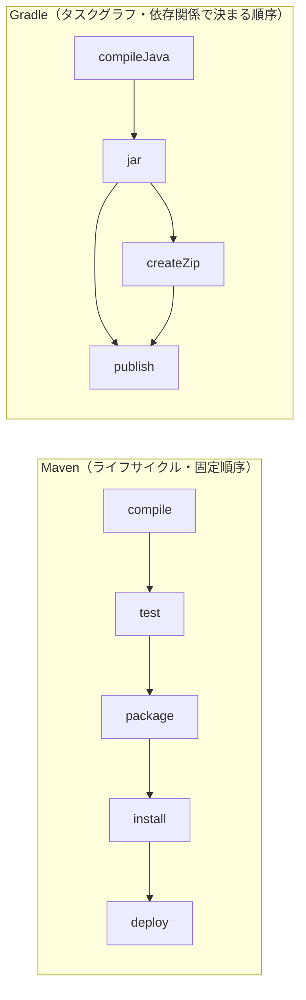
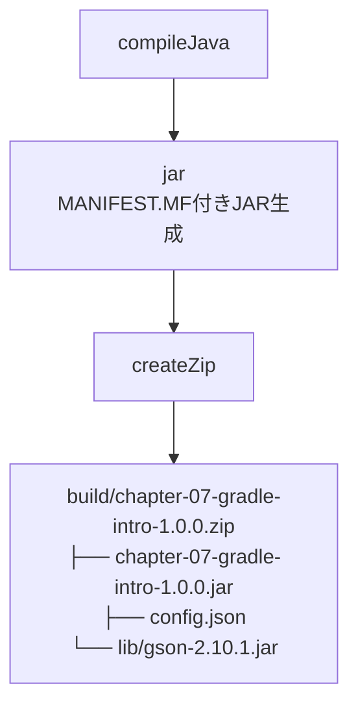
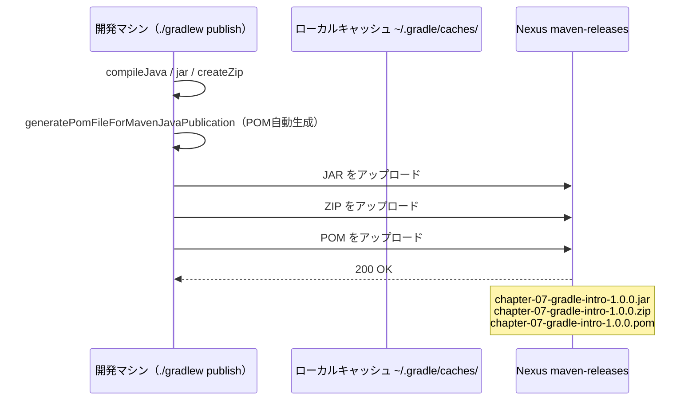

# 第7章: Gradle入門（Mavenからの移行）

第6章では `maven-assembly-plugin` と `zip.xml` を使って「JAR + config.json + 依存ライブラリ」をまとめた ZIP を作成し、Nexus にアップロードしました。
この章では**まったく同じ成果物**を Gradle で作ります。
Maven と Gradle を対比しながら読み進めることで、ビルドツールの違いを肌で感じましょう。

## この章で学ぶこと

- Gradle の基本概念（タスクグラフ）と Maven のライフサイクルの違いを説明できる
- `build.gradle.kts` の各ブロック（plugins・java・repositories・dependencies・jar・tasks・publishing）の役割を Maven と対比して説明できる
- Gradle Wrapper を使う理由と、チーム開発での重要性を説明できる
- `./gradlew build` で JAR と ZIP を生成し、解凍して実行できる
- `~/.gradle/gradle.properties` に認証情報を設定し、`./gradlew publish` で Nexus にアップロードできる

## ステップ1: 第6章の振り返りと「なぜ Gradle を学ぶのか」

### 第2〜6章の振り返り

| 章 | 学んだこと | 主な設定 |
| :--- | :--- | :--- |
| 第2章 | Maven の基本とビルドフェーズ | `<groupId>`・`<artifactId>`・`<version>` |
| 第3章 | 外部ライブラリの取得と依存スコープ | `<dependencies>`・`<scope>` |
| 第4章 | Nexus へのアップロード | `<distributionManagement>`・`settings.xml` |
| 第5章 | `pom.xml` のより良い設定 | `<properties>`・`<reporting>`・`<modules>` |
| 第6章 | 配布パッケージ（ZIP）の作成 | `maven-assembly-plugin`・`zip.xml` |
| **第7章** | **Gradle で同じ成果物を作る** | **`build.gradle.kts`・`settings.gradle.kts`** |

### なぜ現場で Gradle が使われるのか

Maven は長い実績と安定性を持つ優れたビルドツールです。しかし大規模プロジェクトや特定の用途では、Gradle の採用が増えています。

| 現場での理由 | 詳細 |
| :--- | :--- |
| Maven の XML は冗長になりやすい | 条件分岐やループを書くと `pom.xml` が数百行になることがある |
| Gradle は Kotlin/Groovy DSL で記述できる | プログラムとして書けるため、柔軟なビルドロジックを簡潔に表現できる |
| Android アプリ開発では Gradle が標準 | Android Studio はデフォルトで Gradle を採用している |
| 大規模プロジェクトで並列ビルドが高速 | タスクグラフによる差分ビルド・並列実行が得意 |

この章では「Maven でやったことを Gradle でもできる」という体験を通して、両ツールの共通点と違いを学びます。

## ステップ2: Gradle の基本概念と Maven との違い

### Maven は「ライフサイクル」、Gradle は「タスクグラフ」

Maven のビルドは**固定された順序のフェーズ**（ライフサイクル）で進みます。
`mvn deploy` を実行すると、必ず `compile` → `test` → `package` → `install` → `deploy` の順で処理されます。

Gradle のビルドは**タスクの依存関係**で順序が決まります。
タスク A がタスク B に依存していれば、A を実行する前に B が自動的に実行されます。



> [!NOTE]
> 「タスクグラフ」とは、タスク同士の依存関係を矢印でつないだ図のことです。
> Gradle はこのグラフを解析して、必要なタスクだけを必要な順序で実行します。
> Maven のライフサイクルと違い、途中のフェーズをスキップして特定のタスクだけ実行することも得意です。

### Maven と Gradle の設定ファイル対応

| Maven | Gradle | 役割 |
| :--- | :--- | :--- |
| `pom.xml` | `build.gradle.kts` | ビルド設定の主ファイル |
| `pom.xml`（`<artifactId>` など） | `settings.gradle.kts` | プロジェクト名の定義 |
| `src/main/assembly/zip.xml` | `build.gradle.kts` 内の `createZip` タスク | ZIP の中身の定義（Gradle では別ファイル不要） |

Maven では ZIP の中身を `zip.xml` という別ファイルに書く必要がありました。
Gradle では `build.gradle.kts` にインラインで書けるため、ファイル数が減ります。

## ステップ3: Gradle Wrapper のセットアップ

```bash
# 作業ディレクトリへ移動
cd chapter-07-gradle-intro

# 現在地を確認（末尾が chapter-07-gradle-intro であること）
pwd
# => /workspaces/starter-java-build-tools/chapter-07-gradle-intro
```

### システムの Gradle バージョンを確認する

```bash
gradle --version
```

```text
------------------------------------------------------------
Gradle 4.4.1
------------------------------------------------------------
```

Gradle 4.4.1 はかなり古いバージョンです。このまま `gradle build` を実行すると、`build.gradle.kts` の構文でエラーになります。
現場では**Gradle Wrapper**（グレードル・ラッパー）を使って、プロジェクトで使うバージョンを固定します。

### Gradle Wrapper とは何か

Gradle Wrapper は「このプロジェクトで使う Gradle のバージョンを固定し、自動でダウンロードする仕組み」です。
`./gradlew`（Linux/Mac）または `gradlew.bat`（Windows）というスクリプトファイルがその正体です。

### Wrapper を生成する

```bash
gradle wrapper --gradle-version 8.13 --distribution-type bin
```

次のファイルが生成されます。

```text
gradlew                          ← Linux/Mac 用の起動スクリプト
gradlew.bat                      ← Windows 用の起動スクリプト
gradle/wrapper/
├── gradle-wrapper.jar           ← Wrapper 本体（ダウンロードを担当）
└── gradle-wrapper.properties    ← バージョンや配布URLを定義
```

> [!NOTE]
> なぜ Wrapper をリポジトリにコミットするのか？
>
> チームメンバー全員が同じバージョンの Gradle を使うためです。
> `gradle --version` の結果は人によって異なりますが、`./gradlew --version` は全員が同じ結果になります。
> これにより「自分のマシンでは動いたのに、CI（自動ビルド）では動かない」という問題を防げます。
>
> Maven の `mvn` コマンドは Maven Wrapper（`mvnw`）で同様に管理できますが、Gradle では Wrapper が特に普及しています。

### Gradle 8.13 の起動を確認する

```bash
./gradlew --version
```

> [!IMPORTANT]
> 初回の `./gradlew` 実行時は Gradle 8.13 のダウンロードが行われます（約100MB）。
> 数十秒から数分かかる場合があります。ダウンロードが完了するまでそのまま待ってください。

```text
------------------------------------------------------------
Gradle 8.13
------------------------------------------------------------

Build time:   2025-02-26 18:28:55 UTC
Revision:     ...

Kotlin:       2.0.21
Groovy:       3.0.22
Ant:          Apache Ant(TM) version 1.10.15
Launcher JVM: 21.0.x ...
Daemon JVM:   ...
OS:           Linux ...
```

システムの 4.4.1 ではなく、Wrapper で指定した 8.13 が動いていることを確認します。

## ステップ4: settings.gradle.kts と build.gradle.kts を確認する

```bash
cd chapter-07-gradle-intro

pwd
# => /workspaces/starter-java-build-tools/chapter-07-gradle-intro
```

### settings.gradle.kts を確認する

```bash
cat settings.gradle.kts
```

```kotlin
rootProject.name = "chapter-07-gradle-intro"
```

`rootProject.name` はプロジェクト名を定義します。これは Maven の `<artifactId>` に相当します。
生成される JAR や ZIP のファイル名のベースになります（例: `chapter-07-gradle-intro-1.0.0.jar`）。

### build.gradle.kts を確認する

```bash
cat build.gradle.kts
```

```kotlin
plugins {
    java
    `maven-publish`
}

group = "com.example"
version = "1.0.0"

java {
    toolchain {
        languageVersion = JavaLanguageVersion.of(21)
    }
}

repositories {
    mavenCentral()
}

dependencies {
    implementation("com.google.code.gson:gson:2.10.1")
}

tasks.jar {
    manifest {
        attributes(
            "Main-Class" to "com.example.App",
            "Class-Path" to configurations.runtimeClasspath.get()
                .joinToString(" ") { "lib/${it.name}" }
        )
    }
}

tasks.register<Zip>("createZip") {
    archiveFileName = "${project.name}-${project.version}.zip"
    destinationDirectory = layout.buildDirectory

    from(tasks.jar.get().archiveFile)
    from("src/main/resources/config.json")

    into("lib") {
        from(configurations.runtimeClasspath)
    }
}

tasks.named("assemble") {
    dependsOn("createZip")
}

publishing {
    publications {
        create<MavenPublication>("mavenJava") {
            artifactId = project.name
            from(components["java"])
            artifact(tasks.named<Zip>("createZip")) {
                extension = "zip"
            }
        }
    }

    repositories {
        maven {
            name = "NexusReleases"
            url = uri("http://nexus:8081/repository/maven-releases/")
            isAllowInsecureProtocol = true
            credentials {
                username = project.findProperty("nexusUsername") as String? ?: ""
                password = project.findProperty("nexusPassword") as String? ?: ""
            }
        }
        maven {
            name = "NexusSnapshots"
            url = uri("http://nexus:8081/repository/maven-snapshots/")
            isAllowInsecureProtocol = true
            credentials {
                username = project.findProperty("nexusUsername") as String? ?: ""
                password = project.findProperty("nexusPassword") as String? ?: ""
            }
        }
    }
}
```

この `build.gradle.kts` 1ファイルだけで、Maven における `pom.xml` と `zip.xml` の両方の役割を果たしています。
次のステップで、各ブロックを Maven と対比しながら読み解きます。

> [!NOTE]
> Gradle 8 では Kotlin DSL（`.kts` 拡張子）が推奨されています。
> Kotlin DSL は IDE の補完が効きやすく、型安全に設定を記述できるのが特徴です。
> 古いプロジェクトや入門書では Groovy DSL（`.gradle` 拡張子）を使っているものもあり、
> 両方を読める状態にしておくと現場で役立ちます。

## ステップ5: build.gradle.kts の各要素を Maven と対比して読む

### 1. plugins ブロック

```kotlin
plugins {
    java
    `maven-publish`
}
```

| Gradle プラグイン | Maven 相当 | 役割 |
| :--- | :--- | :--- |
| `java` | `maven-compiler-plugin` + `maven-jar-plugin` | Java のコンパイルと JAR 生成 |
| `` `maven-publish` `` | `mvn deploy`（`distributionManagement`） | Nexus などへの成果物のアップロード |

Maven では `pom.xml` に `<dependencies>` を書くだけで `maven-compiler-plugin` が暗黙的に有効になります。
Gradle では `plugins { java }` と明示的に宣言する必要があります。

### 2. java toolchain ブロック

```kotlin
java {
    toolchain {
        languageVersion = JavaLanguageVersion.of(21)
    }
}
```

Maven の `pom.xml` での対応設定は次のとおりです。

```xml
<properties>
  <maven.compiler.release>21</maven.compiler.release>
</properties>
```

Gradle の `toolchain` は「Java 21 を使う」と宣言するだけで、未インストールならダウンロードまで自動で行います。
Maven の `<release>` プロパティはインストール済みの JDK を指定するだけです。

### 3. repositories ブロック

```kotlin
repositories {
    mavenCentral()
}
```

Maven は特に設定しなくても Maven Central からライブラリを取得します（デフォルト動作）。
Gradle では `mavenCentral()` を明示的に書かないと、どこからもライブラリを取得できません。
「明示的に書かなければいけない」ことは冗長に見えますが、「どこからライブラリを取るか」が一目でわかるというメリットがあります。

### 4. dependencies ブロック

```kotlin
dependencies {
    implementation("com.google.code.gson:gson:2.10.1")
}
```

Maven の `pom.xml` での対応設定は次のとおりです。

```xml
<dependency>
  <groupId>com.google.code.gson</groupId>
  <artifactId>gson</artifactId>
  <version>2.10.1</version>
</dependency>
```

`implementation` スコープは Maven の `<scope>compile</scope>`（省略時のデフォルト）に相当します。
コンパイル時と実行時の両方で必要なライブラリに使います。

> [!NOTE]
> Gradle の依存スコープは Maven より細かく分かれています。
> 主なスコープの対応は次のとおりです。
>
> | Gradle | Maven | 意味 |
> | :--- | :--- | :--- |
> | `implementation` | `compile`（デフォルト） | コンパイル・実行の両方で必要 |
> | `testImplementation` | `test` | テスト時のみ必要 |
> | `compileOnly` | `provided` | コンパイル時のみ必要（実行時は不要） |

### 5. tasks.jar ブロック（MANIFEST.MF 設定）

```kotlin
tasks.jar {
    manifest {
        attributes(
            "Main-Class" to "com.example.App",
            "Class-Path" to configurations.runtimeClasspath.get()
                .joinToString(" ") { "lib/${it.name}" }
        )
    }
}
```

Maven の `maven-jar-plugin` での対応設定は次のとおりです。

```xml
<plugin>
  <artifactId>maven-jar-plugin</artifactId>
  <configuration>
    <archive>
      <manifest>
        <mainClass>com.example.App</mainClass>
        <addClasspath>true</addClasspath>
        <classpathPrefix>lib/</classpathPrefix>
      </manifest>
    </archive>
  </configuration>
</plugin>
```

`"Main-Class" to "com.example.App"` は `java -jar` で実行するときの起動クラスを指定します。
`configurations.runtimeClasspath.get().joinToString(" ") { "lib/${it.name}" }` は Kotlin のラムダ式です。
実行時の依存ライブラリ（今回は Gson）のファイル名一覧を取得し、`lib/gson-2.10.1.jar` のような形式で結合しています。
Maven の `<addClasspath>true</addClasspath>` + `<classpathPrefix>lib/</classpathPrefix>` と同じ効果です。

### 6. createZip タスク

```kotlin
tasks.register<Zip>("createZip") {
    archiveFileName = "${project.name}-${project.version}.zip"
    destinationDirectory = layout.buildDirectory

    from(tasks.jar.get().archiveFile)
    from("src/main/resources/config.json")

    into("lib") {
        from(configurations.runtimeClasspath)
    }
}

tasks.named("assemble") {
    dependsOn("createZip")
}
```

これは第6章の `maven-assembly-plugin` + `zip.xml` の代替です。
Maven では ZIP の中身を別ファイル（`zip.xml`）に XML で書く必要がありましたが、Gradle では `build.gradle.kts` にインラインで Kotlin コードとして書けます。

各行の意味は次のとおりです。

| コード | 意味 |
| :--- | :--- |
| `archiveFileName = "..."` | ZIP のファイル名（例: `chapter-07-gradle-intro-1.0.0.zip`） |
| `destinationDirectory = layout.buildDirectory` | ZIP の出力先（`build/` ディレクトリ） |
| `from(tasks.jar.get().archiveFile)` | 生成した JAR を ZIP のルートに含める |
| `from("src/main/resources/config.json")` | `config.json` を ZIP のルートに含める |
| `into("lib") { from(configurations.runtimeClasspath) }` | 依存ライブラリを ZIP 内の `lib/` フォルダに含める |
| `tasks.named("assemble") { dependsOn("createZip") }` | `assemble` タスクが `createZip` に依存することを宣言 |

タスクの依存関係と生成される ZIP の構造を図で確認します。



### 7. publishing ブロック

```kotlin
publishing {
    publications {
        create<MavenPublication>("mavenJava") {
            artifactId = project.name
            from(components["java"])
            artifact(tasks.named<Zip>("createZip")) {
                extension = "zip"
            }
        }
    }
    repositories {
        maven {
            name = "NexusReleases"
            url = uri("http://nexus:8081/repository/maven-releases/")
            isAllowInsecureProtocol = true
            ...
        }
    }
}
```

`artifact(tasks.named<Zip>("createZip"))` により、ZIP ファイルを「付随成果物」として Maven 形式で公開します。
第6章で `maven-assembly-plugin` が ZIP を「attached artifact」として自動登録したのと同じ役割です。

`isAllowInsecureProtocol = true` は Gradle 7 以降の必須設定です。
Gradle 7 からは `http://`（暗号化なし）のリポジトリへのアクセスが既定でブロックされるようになりました。
この学習環境の Nexus は `http://` を使うため、明示的に許可しています。
本番環境では `https://` の Nexus を使うべきであり、この設定は不要です。

> [!NOTE]
> Maven では `http://` リポジトリのブロックは Maven 3.8.1 から導入されました。
> Maven・Gradle ともに「セキュアでない通信はデフォルトで禁止する」という方向で進化しています。
> 参考: [Gradle 公式ドキュメント - Repository Types](https://docs.gradle.org/current/userguide/declaring_repositories.html)

## ステップ6: ./gradlew tasks でタスク一覧を確認する

```bash
cd chapter-07-gradle-intro

pwd
# => /workspaces/starter-java-build-tools/chapter-07-gradle-intro

./gradlew tasks
```

主要なタスクが表示されます。Maven コマンドとの対応は次のとおりです。

| Gradle タスク | Maven コマンド相当 | 役割 |
| :--- | :--- | :--- |
| `compileJava` | `mvn compile` | Java ソースのコンパイル |
| `jar` | `mvn package`（JAR部分） | JAR ファイルの生成 |
| `createZip` | `mvn package`（ZIP部分） | ZIP ファイルの生成 |
| `assemble` | `mvn package` | jar + createZip をまとめて実行 |
| `build` | `mvn verify` | assemble + test |
| `clean` | `mvn clean` | `build/` ディレクトリの削除 |
| `publish` | `mvn deploy` | Nexus へのアップロード |
| `publishToMavenLocal` | `mvn install` | ローカルキャッシュへの登録 |

> [!NOTE]
> `createZip` は "Other tasks" グループに表示されます。
> `assemble` に `dependsOn("createZip")` を設定しているため、`./gradlew build` を実行すれば自動的に ZIP も作成されます。
> `./gradlew createZip` と単独でも実行できます。

## ステップ7: ./gradlew build で JAR と ZIP を生成する

```bash
cd chapter-07-gradle-intro

pwd
# => /workspaces/starter-java-build-tools/chapter-07-gradle-intro

./gradlew build
```

次のようなタスク実行ログが表示されます。

```text
> Task :compileJava
> Task :processResources
> Task :classes
> Task :jar
> Task :createZip
> Task :assemble
> Task :compileTestJava NO-SOURCE
> Task :processTestResources NO-SOURCE
> Task :testClasses UP-TO-DATE
> Task :test NO-SOURCE
> Task :check UP-TO-DATE
> Task :build

BUILD SUCCESSFUL in 43s
4 actionable tasks: 4 executed
```

`compileJava` → `jar` → `createZip` → `assemble` → `build` の順に実行されています。
タスクグラフの依存関係どおりに動いていることが確認できます。

生成されたファイルを確認します。

```bash
ls build/libs/
```

```text
chapter-07-gradle-intro-1.0.0.jar
```

> [!NOTE]
> Maven では `target/` に出力されましたが、Gradle では `build/` に出力されます。
> `build/libs/` が JAR の出力先で、Maven の `target/*.jar` に相当します。
> ZIP は `build/` 直下に生成されます。

ZIP の中身を確認します。

```bash
unzip -l build/chapter-07-gradle-intro-1.0.0.zip
```

```text
Archive:  build/chapter-07-gradle-intro-1.0.0.zip
  Length      Date    Time    Name
---------  ---------- -----   ----
     3552  2026-05-07 11:30   chapter-07-gradle-intro-1.0.0.jar
       94  2026-05-07 11:28   config.json
        0  2026-05-07 11:30   lib/
   283367  2026-05-07 11:30   lib/gson-2.10.1.jar
---------                     -------
   287013                     4 files
```

第6章で Maven が生成した ZIP と同じ構造です。
`chapter-07-gradle-intro-1.0.0.jar`・`config.json`・`lib/gson-2.10.1.jar` の3要素が揃っています。

## ステップ8: ZIP を解凍して実行する

```bash
cd chapter-07-gradle-intro

pwd
# => /workspaces/starter-java-build-tools/chapter-07-gradle-intro
```

ZIP を解凍して実行します。

```bash
mkdir -p ~/app-release-gradle
unzip build/chapter-07-gradle-intro-1.0.0.zip -d ~/app-release-gradle
cd ~/app-release-gradle
java -jar chapter-07-gradle-intro-1.0.0.jar
```

次の出力が得られます（第6章と同じ結果です）。

```text
=== 売上レポート集計ツール v1.0.0 起動 ===
処理上限: 5 件
  [001] 売上レコード処理完了
  [002] 売上レコード処理完了
  [003] 売上レコード処理完了
  [004] 売上レコード処理完了
  [005] 売上レコード処理完了
=== 処理完了 ===
```

Maven で作った ZIP と Gradle で作った ZIP、どちらを解凍して実行しても同じ結果になりました。
ビルドツールが違っても、正しく設定すれば同じ成果物を作れることが確認できました。

> [!IMPORTANT]
> 元の作業ディレクトリに戻ってから、次のステップへ進んでください。
>
> ```bash
> cd /workspaces/starter-java-build-tools/chapter-07-gradle-intro
> ```

## ステップ9: Nexus への認証情報を設定する

Maven では `~/.m2/settings.xml` に認証情報を書きましたが、Gradle では `~/.gradle/gradle.properties` に書きます。
**認証情報を `build.gradle.kts` に直接書かないのは、Maven と同じ理由です。**
`build.gradle.kts` はリポジトリにコミットするファイルであり、パスワードをそこに書くと誰でも見られてしまいます。

### Maven と Gradle の認証情報管理の対応

| 役割 | Maven | Gradle |
| :--- | :--- | :--- |
| 認証情報ファイル | `~/.m2/settings.xml` | `~/.gradle/gradle.properties` |
| ユーザー名の設定 | `<username>admin</username>` | `nexusUsername=admin` |
| パスワードの設定 | `<password>...</password>` | `nexusPassword=...` |
| ビルドファイルとの連携 | `<id>` タグで紐付け | `project.findProperty("nexusUsername")` |

### gradle.properties を作成する

```bash
cd chapter-07-gradle-intro

pwd
# => /workspaces/starter-java-build-tools/chapter-07-gradle-intro
```

現在の `gradle.properties` の状態を確認します。

```bash
cat ~/.gradle/gradle.properties 2>/dev/null || echo "gradle.properties は存在しません（新規作成します）"
```

次の内容で `~/.gradle/gradle.properties` を作成します。

```properties
nexusUsername=admin
nexusPassword=（設定したパスワード）
```

`build.gradle.kts` の `project.findProperty("nexusUsername")` はこのファイルの値を読み取ります。
ファイルが存在しない場合や値が設定されていない場合は、`as String? ?: ""` により空文字列にフォールバックします。

> [!NOTE]
> `~/.gradle/gradle.properties` はホームディレクトリ配下に置くため、リポジトリにはコミットされません。
> チームメンバーはそれぞれ自分の Nexus 認証情報をここに設定します。

## ステップ10: ./gradlew publish で Nexus にアップロードする

### Nexus の起動を確認する

```bash
docker ps | grep nexus
```

`nexus` コンテナが実行中であることを確認します。表示されない場合は第4章の手順で起動してください。

### publish の流れ

`./gradlew publish` を実行すると、次の順序で処理が行われます。



Maven と Gradle の publish の比較は次のとおりです。

| 項目 | Maven | Gradle |
| :--- | :--- | :--- |
| コマンド | `mvn deploy` | `./gradlew publish` |
| POM の生成 | `pom.xml` をそのままアップロード | `build.gradle.kts` から POM を自動生成 |
| 認証情報の参照 | `~/.m2/settings.xml` の `<id>` で紐付け | `~/.gradle/gradle.properties` の `project.findProperty()` |
| ZIP のアップロード | `maven-assembly-plugin` が自動登録（attached artifact） | `artifact(tasks.named<Zip>("createZip"))` で明示的に追加 |

### publish を実行する

```bash
cd chapter-07-gradle-intro

pwd
# => /workspaces/starter-java-build-tools/chapter-07-gradle-intro

./gradlew publish
```

`BUILD SUCCESSFUL` が表示されれば成功です。

### Nexus UI で確認する

VS Code の「ポート」タブを開き、ポート **8081** の行にある転送アドレスをクリックして Nexus の UI を開きます。

1. 右上の「Sign in」からログインする
2. 左のメニューから「Browse」をクリックする
3. `maven-releases` リポジトリをクリックする
4. `com` → `example` → `chapter-07-gradle-intro` → `1.0.0` と辿る
5. `.jar`・`.zip`・`.pom` の3ファイルが並んでいることを確認する

第6章で Maven が `mvn deploy` でアップロードした構造と同じ形式で保存されています。
Maven と Gradle のどちらを使っても、Nexus からは「同じ形式の Maven リポジトリ」として扱われます。

## 確認してみよう

1. Gradle の「タスクグラフ」と Maven の「ライフサイクルフェーズ」の違いを説明してください。`./gradlew publish` を実行したとき、なぜ `compileJava` が自動的に先に実行されるのですか？
2. `build.gradle.kts` の `tasks.jar { manifest { attributes(...) } }` は、Maven の `pom.xml` のどの設定に相当しますか？また `joinToString(" ") { "lib/${it.name}" }` という記述は何を意味していますか？
3. Gradle で Nexus への認証情報を `build.gradle.kts` に直接書かず、`~/.gradle/gradle.properties` に書く理由を Maven の `settings.xml` との類似性を踏まえて説明してください。
4. `build.gradle.kts` で `isAllowInsecureProtocol = true` を設定しているのはなぜですか？Maven の `pom.xml` にはこの設定がない理由も合わせて説明してください。
5. 第6章では `maven-assembly-plugin` と `zip.xml`（別ファイル）が必要でしたが、Gradle では `createZip` タスクを `build.gradle.kts` 内にインラインで書けました。この違いがもたらすメリットとデメリットを考えてみてください。

## まとめ

| 作業 | Maven | Gradle |
| :--- | :--- | :--- |
| ビルド設定ファイル | `pom.xml`（XML） | `build.gradle.kts`（Kotlin DSL） |
| プロジェクト名定義 | `pom.xml` の `<artifactId>` | `settings.gradle.kts` の `rootProject.name` |
| ZIP の中身定義 | `zip.xml`（別ファイル） | `build.gradle.kts` 内の `createZip` タスク |
| コンパイル | `mvn compile` | `./gradlew compileJava` |
| JAR + ZIP 生成 | `mvn package` | `./gradlew build` |
| Nexus へのアップロード | `mvn deploy` | `./gradlew publish` |
| 認証情報ファイル | `~/.m2/settings.xml` | `~/.gradle/gradle.properties` |
| 出力ディレクトリ | `target/` | `build/` |
| バージョン固定の仕組み | Maven Wrapper（`mvnw`） | Gradle Wrapper（`./gradlew`） |

この章で最も重要なポイントは「Maven と Gradle はアプローチが違うが、作れる成果物は同じ」という点です。
Maven はフェーズという固定の流れで動き、Gradle はタスクの依存関係で動きます。
どちらを使うかはプロジェクトの方針やチームの慣習によりますが、両方を読める・書けることが現場では強みになります。

次章では Gradle のプラグイン機能をより深く掘り下げ、Fat JAR（実行可能 JAR）の作成やコードフォーマットの自動化に挑戦します。

---

| [← 第6章: アセンブリと独自パッケージング](../chapter-06-maven-package/README.md) | [全章目次](../README.md) | [第8章: Gradleプラグインの実践活用 →](../chapter-08-gradle-plugins/README.md) |
| :--- | :---: | ---: |
