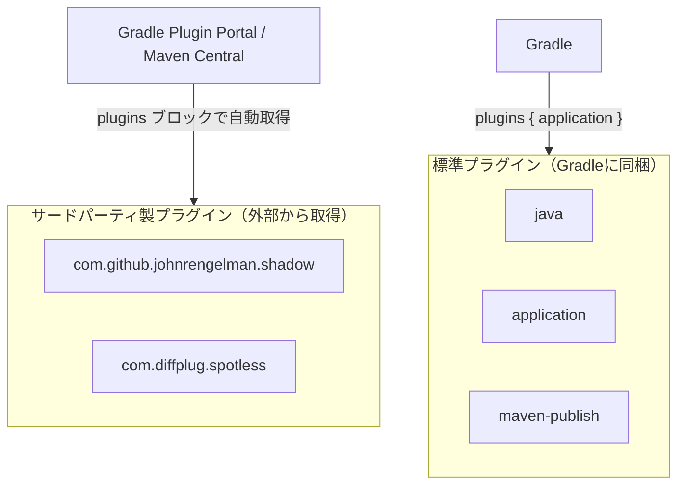
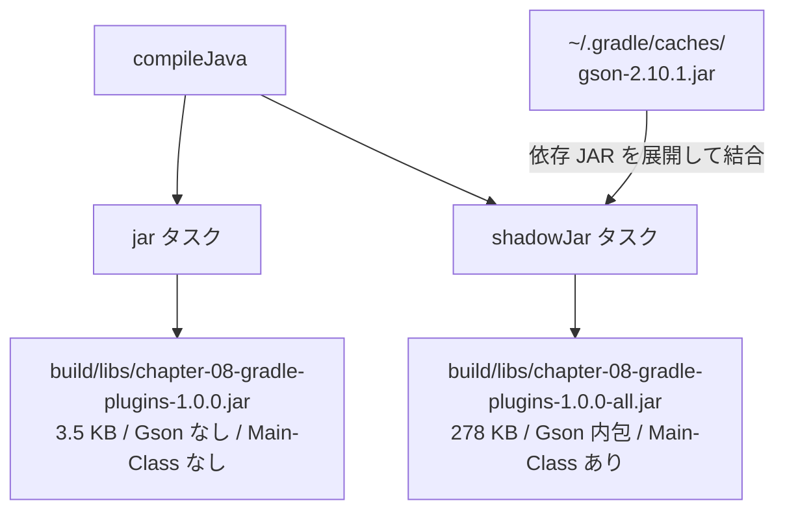
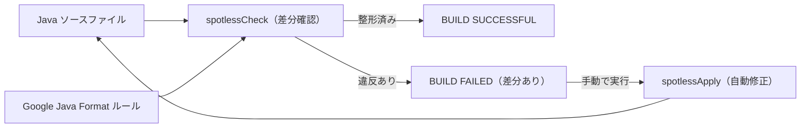

# 第8章: Gradleプラグインの実践活用

第7章では Gradle の基本を学びました。Kotlin DSL でビルドを記述し、タスクグラフの仕組みを理解し、`maven-publish` プラグインで Nexus にアップロードするまでを体験しました。

この章では**同じアプリ**を題材に、サードパーティ製プラグインを 2 本導入します。
「プラグインを追加するだけで、これだけのことが自動化できる」という体験を通じて、Gradle プラグインエコシステムの威力を実感しましょう。

## この章で学ぶこと

- Gradle プラグインの種類（標準プラグインとサードパーティ製プラグイン）の違いを説明できる
- `application` プラグインが提供する `run` タスクを使ってアプリを直接実行できる
- `com.github.johnrengelman.shadow` プラグインで Fat JAR（依存ライブラリを内包した単一の JAR）を生成できる
- Fat JAR と通常の JAR の違いを、ファイルサイズと `MANIFEST.MF` の内容で説明できる
- `com.diffplug.spotless` プラグインでコードフォーマットを自動化し、フォーマット違反をビルドで検出できる
- プラグインの DSL 設定を公式ドキュメントから調べる習慣を身につける

## ステップ1: 第7章の振り返りと「なぜプラグインを学ぶのか」

### 第7章までの振り返り

| 章 | 学んだこと | 主な設定 |
| :--- | :--- | :--- |
| 第2章 | Maven の基本とビルドフェーズ | `<groupId>`・`<artifactId>`・`<version>` |
| 第3章 | 外部ライブラリの取得と依存スコープ | `<dependencies>`・`<scope>` |
| 第4章 | Nexus へのアップロード | `<distributionManagement>`・`settings.xml` |
| 第5章 | `pom.xml` のより良い設定 | `<properties>`・`<reporting>`・`<modules>` |
| 第6章 | 配布パッケージ（ZIP）の作成 | `maven-assembly-plugin`・`zip.xml` |
| 第7章 | Gradle で同じ成果物を作る | `build.gradle.kts`・タスクグラフ・`maven-publish` |
| **第8章** | **プラグインでビルドを拡張する** | **Shadow JAR・Spotless** |

### なぜプラグインを学ぶのか

第7章で使った `java` プラグインや `maven-publish` プラグインは、Gradle に最初から同梱されている**標準プラグイン**です。
しかし現場のプロジェクトでは、標準プラグインだけでは足りない場面が必ず出てきます。

代表的な例を見てみましょう。

| 現場での課題 | プラグインによる解決 |
| :--- | :--- |
| 依存ライブラリを含む JAR を 1ファイルで配布したい | Shadow（Fat JAR 生成） |
| チーム全員のコードフォーマットを統一したい | Spotless（自動整形） |
| テストカバレッジ（コードのどの部分がテストされているか）を計測したい | JaCoCo |
| 静的解析（バグになりやすいコードを検出）を自動化したい | Checkstyle / PMD |

Gradle のプラグインシステムを使うと、`build.gradle.kts` に数行追加するだけでこれらの機能が手に入ります。
Maven のプラグインと同様に、「車輪の再発明」をせずに現場の知恵を再利用できるのがプラグインの価値です。

## ステップ2: Gradleプラグインの基礎（標準プラグインとサードパーティ製プラグインの違い）

### プラグインには 2 種類ある



**標準プラグイン**は Gradle のインストールに含まれているため、`plugins { java }` のように**バージョン指定なし**で使えます。

**サードパーティ製プラグイン**は [Gradle Plugin Portal](https://plugins.gradle.org/) や Maven Central で公開されており、`id("プラグインID") version "バージョン"` の形式で取得します。

`build.gradle.kts` の `plugins` ブロックを見ると、この違いがはっきり分かります。

```kotlin
plugins {
    application                                          // 標準プラグイン（バージョン指定なし）
    id("com.github.johnrengelman.shadow") version "8.1.1"  // サードパーティ製（バージョン指定あり）
    id("com.diffplug.spotless") version "7.0.2"            // サードパーティ製（バージョン指定あり）
}
```

> [!NOTE]
> Maven でいう「標準プラグイン」は `maven-compiler-plugin` や `maven-jar-plugin` のように `pom.xml` に書かなくても暗黙的に有効になるものです。
> Gradle の標準プラグインも、Gradle 本体と一緒に配布されているという点では同じ立ち位置です。

### よくある新人エンジニアのミス

標準プラグインに `version` を指定しようとするとエラーになります。

```kotlin
// NG: 標準プラグインにバージョンを書いてはいけない
plugins {
    id("java") version "21"  // エラー: Core plugin 'java' does not support version selection
}

// OK: 標準プラグインはショートハンドで書く
plugins {
    java
}
```

## ステップ3: プラグインのDSL設定を調べる方法

新しいプラグインを導入するとき、「どう設定するのか」を調べる方法を知っておくことが重要です。

```bash
# 作業ディレクトリへ移動
cd chapter-08-gradle-plugins

# 現在地を確認（末尾が chapter-08-gradle-plugins であること）
pwd
# => /workspaces/starter-java-build-tools/chapter-08-gradle-plugins
```

### 方法1: Gradle Plugin Portal で検索する

[https://plugins.gradle.org/](https://plugins.gradle.org/) にアクセスし、プラグイン名で検索します。
各プラグインのページに `plugins {}` への追加方法と設定例が載っています。

### 方法2: プラグイン公式リポジトリ / ドキュメントを確認する

- Shadow: [https://gradleup.com/shadow/](https://gradleup.com/shadow/)
- Spotless: [https://github.com/diffplug/spotless/tree/main/plugin-gradle](https://github.com/diffplug/spotless/tree/main/plugin-gradle)

公式ドキュメントは英語ですが、設定例（コードスニペット）を読むだけで多くのことが分かります。
一次情報（公式ドキュメント）を参照する習慣は現場で非常に重要です。

### 方法3: ./gradlew tasks でタスク一覧を確認する

```bash
pwd
# => /workspaces/starter-java-build-tools/chapter-08-gradle-plugins

./gradlew tasks
```

プラグインを追加すると、提供されるタスクが一覧に追加されます。
出力の中から第8章の主要タスクを探してみましょう。

```text
Application tasks
-----------------
run - Runs this project as a JVM application

Shadow tasks
------------
shadowJar - Create a combined JAR of project and runtime dependencies
runShadow - Runs this project as a JVM application using the shadow jar

Spotless tasks
--------------
spotlessApply - Applies code formatting steps to sourcecode in-place.
spotlessCheck - Checks that sourcecode satisfies formatting steps.
```

### 方法4: ./gradlew help --task でタスクの詳細を確認する

```bash
pwd
# => /workspaces/starter-java-build-tools/chapter-08-gradle-plugins

./gradlew help --task shadowJar
```

タスクの説明・依存関係・利用可能なオプションが表示されます。

## ステップ4: build.gradle.kts を確認する

```bash
pwd
# => /workspaces/starter-java-build-tools/chapter-08-gradle-plugins

cat build.gradle.kts
```

```kotlin
plugins {
    application
    id("com.github.johnrengelman.shadow") version "8.1.1"
    id("com.diffplug.spotless") version "7.0.2"
}

group = "com.example"
version = "1.0.0"

java {
    toolchain {
        languageVersion = JavaLanguageVersion.of(21)
    }
}

application {
    mainClass = "com.example.App"
}

repositories {
    mavenLocal()
    maven {
        url = uri("http://nexus:8081/repository/maven-public/")
        isAllowInsecureProtocol = true
    }
    mavenCentral()
}

dependencies {
    implementation("com.google.code.gson:gson:2.10.1")
}

tasks.shadowJar {
    archiveClassifier = "all"
}

tasks.named("assemble") {
    dependsOn(tasks.shadowJar)
}

spotless {
    java {
        googleJavaFormat()
    }
}
```

第7章の `build.gradle.kts` と比べると、次の点が変わっています。

| 変更点 | 第7章 | 第8章 |
| :--- | :--- | :--- |
| `plugins` ブロック | `java`・`maven-publish` | `application`・`shadow`・`spotless` |
| `application` ブロック | なし | `mainClass` を一元管理 |
| `repositories` | `mavenCentral()` のみ | `mavenLocal()` → Nexus → `mavenCentral()` |
| `tasks.jar` ブロック | `MANIFEST.MF` を手動設定 | `application` プラグインが自動管理 |
| `tasks.shadowJar` | なし | Fat JAR の設定 |
| `spotless` ブロック | なし | Google Java Format の強制 |

## ステップ5: applicationプラグインとリポジトリ設定を理解する

### application プラグインと java プラグインの関係

第7章では `plugins { java }` と書き、`tasks.jar { manifest { attributes("Main-Class" to ...) } }` で起動クラスを手動設定しました。

第8章では `plugins { application }` に変わっています。
`application` プラグインは内部で `java` プラグインを自動的に有効化します。
さらに `application { mainClass = "com.example.App" }` の設定から `MANIFEST.MF` の `Main-Class` を自動的に設定します。

```kotlin
// 第7章: java プラグイン + 手動での MANIFEST.MF 設定
plugins { java }
tasks.jar {
    manifest {
        attributes("Main-Class" to "com.example.App")
    }
}

// 第8章: application プラグイン + mainClass の一元管理
plugins { application }
application {
    mainClass = "com.example.App"
}
```

`mainClass` を一箇所で設定するだけで、`run` タスク・`shadowJar` タスク・`MANIFEST.MF` のすべてに同じ値が使われます。
コードが増えるほど「設定の一元管理」は重要になります。

> [!NOTE]
> `application` プラグインの詳細は Gradle 公式ドキュメントで確認できます。
> 参考: [Gradle Application Plugin](https://docs.gradle.org/current/userguide/application_plugin.html)

### repositories の優先順序

```kotlin
repositories {
    mavenLocal()   // 1番目: ローカルキャッシュ（~/.m2/repository）
    maven {
        url = uri("http://nexus:8081/repository/maven-public/")
        isAllowInsecureProtocol = true
    }              // 2番目: 社内 Nexus リポジトリ
    mavenCentral() // 3番目: Maven Central（インターネット）
}
```

Gradle は上から順にリポジトリを探し、最初に見つかった場所からダウンロードします。
この順序には明確な理由があります。

| 優先順序 | リポジトリ | 理由 |
| :--- | :--- | :--- |
| 1番目 | `mavenLocal()` | 既にローカルにあるものを再ダウンロードしない（高速・オフライン対応） |
| 2番目 | Nexus | 社内で管理・承認されたライブラリを優先的に使う（セキュリティ・ガバナンス） |
| 3番目 | `mavenCentral()` | Nexus にないものだけ外部から取得する |

> [!IMPORTANT]
> 順序を逆にする危険性: `mavenCentral()` を最初に書くと、社内 Nexus に同名の独自ライブラリが登録されていても、外部の Maven Central のものが優先されてしまいます。これは**依存性混乱攻撃（dependency confusion attack）**と呼ばれるセキュリティリスクにもつながります。
> 現場では「社内リポジトリを優先」という設計を意識してください。

## ステップ6: ./gradlew run でアプリを直接実行する

`application` プラグインが提供する `run` タスクを使うと、JAR を別途作らずに直接アプリを起動できます。

```bash
pwd
# => /workspaces/starter-java-build-tools/chapter-08-gradle-plugins
```

`./gradlew run` の作業ディレクトリはプロジェクトルート（`chapter-08-gradle-plugins/`）です。
アプリが `config.json` をカレントディレクトリから読み込むため、先にコピーします。

```bash
cp src/main/resources/config.json .
./gradlew run
```

```text
> Task :compileJava
> Task :processResources
> Task :classes
> Task :run

=== 売上レポート集計ツール v1.0.0 起動 ===
処理上限: 5 件
  [001] 売上レコード処理完了
  [002] 売上レコード処理完了
  [003] 売上レコード処理完了
  [004] 売上レコード処理完了
  [005] 売上レコード処理完了
=== 処理完了 ===

BUILD SUCCESSFUL
```

> [!NOTE]
> `./gradlew run` は「コンパイル → クラスファイルをそのまま実行」します。
> JAR ファイルを経由しないため、開発中の素早い動作確認に便利です。
> `java -jar` は JAR が必要なため、配布や本番実行に向いています。

## ステップ7: ShadowJarプラグインとは（Fat JARの仕組み）

### Fat JAR が必要になる背景

第7章で作った ZIP 配布パッケージを思い出してください。

```text
chapter-07-gradle-intro-1.0.0.zip
├── chapter-07-gradle-intro-1.0.0.jar  ← アプリ本体
├── config.json
└── lib/
    └── gson-2.10.1.jar                ← 依存ライブラリ
```

ZIP を受け取った人は、展開してから `java -jar` で実行する必要がありました。
さらに `MANIFEST.MF` の `Class-Path` が `lib/gson-2.10.1.jar` を指しているため、`lib/` フォルダも一緒に置かないと動きません。

**Fat JAR（ファット・ジャー）**とは、アプリ本体のクラスファイルと依存ライブラリを 1 つの JAR に詰め込んだものです。

```text
chapter-08-gradle-plugins-1.0.0-all.jar  ← これ 1 ファイルだけで動く
（中身）
├── com/example/App.class          ← アプリのクラスファイル
├── com/google/gson/Gson.class     ← Gson のクラスファイル（展開して内包）
├── com/google/gson/JsonParser.class
└── ... (Gson の全クラス)
```

`java -jar chapter-08-gradle-plugins-1.0.0-all.jar` だけで実行できます。
ZIP の展開も、`lib/` フォルダも不要です。

### Shadow プラグインの仕組み

Shadow は `shadowJar` タスクで次の処理を行います。

1. 通常の `jar` タスクと同じようにアプリのクラスファイルを含める
2. `runtimeClasspath`（実行時に必要な依存ライブラリ）の JAR をすべて展開する
3. 展開したクラスファイルをアプリのクラスファイルと一緒に 1 つの JAR にまとめる
4. `application` プラグインの `mainClass` 設定から `Main-Class` を `MANIFEST.MF` に自動設定する

> [!NOTE]
> Shadow プラグインの公式ドキュメント: [https://gradleup.com/shadow/](https://gradleup.com/shadow/)
> `archiveClassifier`・除外設定・リロケーション（パッケージ名の変更）など、高度な設定方法が載っています。

## ステップ8: ./gradlew shadowJar でFat JARを生成する

```bash
pwd
# => /workspaces/starter-java-build-tools/chapter-08-gradle-plugins

./gradlew shadowJar
```

```text
> Task :compileJava
> Task :processResources
> Task :classes
> Task :shadowJar

BUILD SUCCESSFUL
```

生成されたファイルを確認します。

```bash
pwd
# => /workspaces/starter-java-build-tools/chapter-08-gradle-plugins

ls -lh build/libs/
```

```text
-rw-r--r-- 1 user user 278K May  7 11:30 chapter-08-gradle-plugins-1.0.0-all.jar
-rw-r--r-- 1 user user 3.5K May  7 11:30 chapter-08-gradle-plugins-1.0.0.jar
```

ファイルサイズの違いに注目してください。
通常の JAR（3.5 KB）に対して、Fat JAR（278 KB）は約 80 倍のサイズです。
この差は Gson ライブラリ（約 283 KB）が内包されているためです。

タスクの関係と出力ファイルの違いを図で確認します。



> [!NOTE]
> `archiveClassifier = "all"` の意味
>
> `build.gradle.kts` に `tasks.shadowJar { archiveClassifier = "all" }` と書いています。
> `archiveClassifier` はファイル名の末尾に付く識別子です。
> `"all"` を設定することで `chapter-08-gradle-plugins-1.0.0-all.jar` というファイル名になり、
> 通常の `chapter-08-gradle-plugins-1.0.0.jar` と区別できます。
> 設定しないと `shadowJar` が通常の `jar` タスクの出力を上書きしてしまいます。

### assemble タスクで両方を生成する

`build.gradle.kts` に次の記述があります。

```kotlin
tasks.named("assemble") {
    dependsOn(tasks.shadowJar)
}
```

これにより `./gradlew build` を実行すると、通常の JAR と Fat JAR の両方が自動的に生成されます。

```bash
pwd
# => /workspaces/starter-java-build-tools/chapter-08-gradle-plugins

./gradlew build
ls build/libs/
```

```text
chapter-08-gradle-plugins-1.0.0-all.jar
chapter-08-gradle-plugins-1.0.0.jar
```

## ステップ9: Fat JARの中身を確認して実行する

### MANIFEST.MF の違いを確認する

通常の JAR と Fat JAR の `MANIFEST.MF` を比べてみましょう。

```bash
pwd
# => /workspaces/starter-java-build-tools/chapter-08-gradle-plugins

# 通常の JAR の MANIFEST.MF
unzip -p build/libs/chapter-08-gradle-plugins-1.0.0.jar META-INF/MANIFEST.MF
```

```text
Manifest-Version: 1.0
```

```bash
# Fat JAR の MANIFEST.MF
unzip -p build/libs/chapter-08-gradle-plugins-1.0.0-all.jar META-INF/MANIFEST.MF
```

```text
Manifest-Version: 1.0
Main-Class: com.example.App
```

通常の JAR には `Main-Class` がないため、`java -jar` で実行しようとするとエラーになります。
Fat JAR には Shadow プラグインが `application { mainClass }` の設定を読み取り、自動で `Main-Class` を設定します。

### 通常の JAR の実行を試みる（期待通りの失敗）

```bash
pwd
# => /workspaces/starter-java-build-tools/chapter-08-gradle-plugins

java -jar build/libs/chapter-08-gradle-plugins-1.0.0.jar
```

```text
build/libs/chapter-08-gradle-plugins-1.0.0.jar にメイン・マニフェスト属性がありません
```

`Main-Class` がないため起動できません。これは意図通りの動作です。

### Fat JAR を実行する

`config.json` が必要です。プロジェクトルートにコピーされていることを確認します。

```bash
pwd
# => /workspaces/starter-java-build-tools/chapter-08-gradle-plugins

ls config.json 2>/dev/null || cp src/main/resources/config.json .
java -jar build/libs/chapter-08-gradle-plugins-1.0.0-all.jar
```

```text
=== 売上レポート集計ツール v1.0.0 起動 ===
処理上限: 5 件
  [001] 売上レコード処理完了
  [002] 売上レコード処理完了
  [003] 売上レコード処理完了
  [004] 売上レコード処理完了
  [005] 売上レコード処理完了
=== 処理完了 ===
```

ZIP の展開も、`lib/` フォルダも不要です。Fat JAR 1 ファイルで完結しました。

> [!NOTE]
> Fat JAR は便利ですが、万能ではありません。
> 採用が適切でないケースも覚えておきましょう。
>
> - **ライセンス問題**: 依存ライブラリのライセンスによっては、コードを 1 つにまとめて配布することが制限される場合があります
> - **ファイルサイズ**: 依存ライブラリが多いと Fat JAR が数十 MB になることもあり、配布コストが上がります
> - **クラスの重複**: 複数の依存ライブラリが同名のクラスを持つ場合、どちらかが上書きされてしまう可能性があります
>
> Web アプリ（WAR / Spring Boot）やライブラリの配布では、別の手法が使われることが多いです。

## ステップ10: Spotlessプラグインとは（コード整形の自動化）

### コードフォーマットを統一する意義

チーム開発では、複数人が書いたコードを 1 つのリポジトリで管理します。
インデントが「スペース 2 個派」と「スペース 4 個派」が混在すると、どうなるでしょうか。

```java
// A さんのコード（2スペース）
public class App {
  public static void main(String[] args) {
    System.out.println("Hello");
  }
}

// B さんのコード（4スペース）
public class App {
    public static void main(String[] args) {
        System.out.println("Hello");
    }
}
```

どちらも Java としては正しく動きますが、`git diff` でフォーマットの差分だけが大量に出てしまい、本当の変更箇所が見えにくくなります。
**コードフォーマットをビルドに組み込む**ことで、「フォーマット違反はそもそもビルドが通らない」という仕組みを作れます。

### Spotless と Google Java Format

`build.gradle.kts` の設定を確認します。

```kotlin
spotless {
    java {
        googleJavaFormat()
    }
}
```

`googleJavaFormat()` は Google が定めた Java コードのフォーマットルールを適用します。
最大の特徴は**インデントが 2 スペース**（Java の慣習的な 4 スペースとは異なる）です。

第8章の `App.java` を見ると、`public static void main` が 2 スペースでインデントされています。
これは Spotless の `spotlessApply` で自動修正済みの状態です。

### Spotless のフロー



| タスク | 動作 | 使うタイミング |
| :--- | :--- | :--- |
| `spotlessCheck` | フォーマット違反があると `BUILD FAILED` を出す | CI / `build` タスクで自動実行 |
| `spotlessApply` | フォーマット違反を自動修正する | ローカル開発中に手動実行 |

> [!NOTE]
> Spotless の公式ドキュメント（Gradle 向け）:
> [https://github.com/diffplug/spotless/tree/main/plugin-gradle](https://github.com/diffplug/spotless/tree/main/plugin-gradle)
>
> Google Java Format の詳細:
> [https://google.github.io/styleguide/javaguide.html](https://google.github.io/styleguide/javaguide.html)

## ステップ11: フォーマット違反を試して自動修正する

実際にフォーマット違反を起こして、Spotless がどう動くかを体験します。

```bash
pwd
# => /workspaces/starter-java-build-tools/chapter-08-gradle-plugins
```

### フォーマット違反を意図的に作る

`src/main/java/com/example/App.java` を開き、`main` メソッドのインデントを 2 スペースから 4 スペースに変更します。

変更前（正しい状態）

```java
public class App {
  public static void main(String[] args) throws IOException {
```

変更後（違反状態）

```java
public class App {
    public static void main(String[] args) throws IOException {
```

`public static void main` の行頭の空白を 2 個から 4 個に増やしてください。
VS Code でファイルを開き、該当行を手動で編集します。

### spotlessCheck でフォーマット違反を検出する

```bash
pwd
# => /workspaces/starter-java-build-tools/chapter-08-gradle-plugins

./gradlew spotlessCheck
```

```text
> Task :spotlessJavaCheck FAILED

FAILURE: Build failed with an exception.

* What went wrong:
Execution failed for task ':spotlessJavaCheck'.
> The following files had format violations:
      src/main/java/com/example/App.java
          @@ -7,7 +7,7 @@
           public class App {
          -  public static void main(String[] args) throws IOException {
          +    public static void main(String[] args) throws IOException {
  Run './gradlew spotlessApply' to fix these violations.
```

差分が表示され、`BUILD FAILED` になりました。
エラーメッセージに `./gradlew spotlessApply` を実行するよう案内が出ています。

> [!NOTE]
> CI（継続的インテグレーション）環境では `./gradlew build` の中で `spotlessCheck` が自動的に実行されます。
> フォーマット違反があるとビルドが失敗し、プルリクエストのマージが阻止されます。
> これにより「フォーマットを確認し忘れた」というヒューマンエラーをシステムで防げます。

### spotlessApply で自動修正する

```bash
pwd
# => /workspaces/starter-java-build-tools/chapter-08-gradle-plugins

./gradlew spotlessApply
```

```text
> Task :spotlessJava

BUILD SUCCESSFUL
```

`App.java` を確認すると、インデントが 2 スペースに自動修正されています。

```bash
./gradlew spotlessCheck
```

```text
BUILD SUCCESSFUL
```

フォーマット違反がなくなったことを確認できました。

> [!IMPORTANT]
> `spotlessApply` はソースファイルを**直接書き換えます**。
> 大切な変更が上書きされないよう、`git status` で変更内容を確認してから実行する習慣をつけましょう。

## 確認してみよう

1. `build.gradle.kts` で `application` のように書く場合と、`id("com.github.johnrengelman.shadow")` のように書く場合の違いは何ですか？なぜ Shadow は `id(...)` 形式が必要なのですか？
2. `repositories` ブロックで `mavenLocal()` → Nexus → `mavenCentral()` の順に並べています。この順序に意味はありますか？逆順にした場合、どのような不具合が発生しますか？
3. `./gradlew shadowJar` で生成された Fat JAR と、`jar` タスクで生成された通常の JAR のファイルサイズを比較してください。なぜこれほど差があるのですか？
4. Fat JAR は「単独実行できる」という点で便利ですが、どのような場合に Fat JAR の採用が適切でなくなりますか？（例: 依存ライブラリのライセンス、配布物のサイズ）
5. `./gradlew spotlessCheck` を実行してフォーマット違反が検出されたとき、CI 環境でのビルドはどうなりますか？なぜコードフォーマットをビルドに組み込むことが現場で好まれるのですか？

## まとめ

| 項目 | 第7章（maven-publish） | 第8章（shadow + spotless） |
| :--- | :--- | :--- |
| プラグイン種別 | 標準プラグイン | サードパーティ製プラグイン |
| 配布物 | JAR + lib/ + config.json の ZIP | Fat JAR（依存を内包した単一ファイル） |
| 実行方法 | java -jar + Class-Path 指定 | java -jar 1ファイルで完結 |
| コード品質保証 | なし | Spotless（Google Java Format） |

この章で最も重要なポイントは 2 つです。

**1. プラグインはビルドの「拡張機能」である**
`build.gradle.kts` に数行追加するだけで、Fat JAR 生成やコードフォーマット強制という複雑な処理が自動化されました。
現場では「自分でスクリプトを書く」より「実績のあるプラグインを活用する」ことが推奨されます。

**2. 公式ドキュメントを調べる習慣を持つ**
プラグインの設定方法は Gradle Plugin Portal や各プラグインの公式リポジトリに載っています。
一次情報を参照する習慣は、現場での自己解決力に直結します。

---

| [← 第7章: Gradle入門（Mavenからの移行）](../chapter-07-gradle-intro/README.md) | [全章目次](../README.md) | 最終章 |
| :--- | :---: | ---: |
